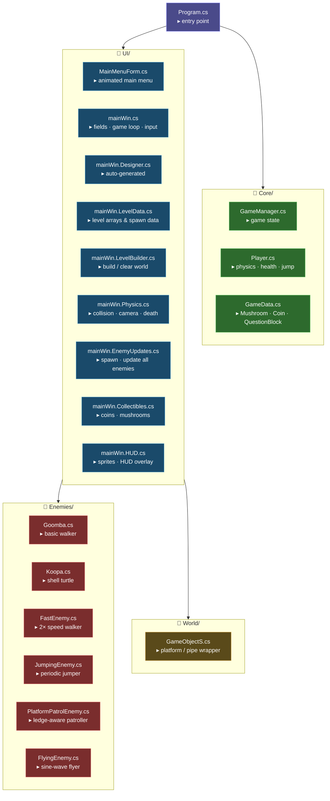
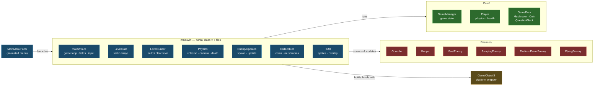

# Super Mario — C# WinForms Platformer

A Mario-style 2D platformer built with C# .NET Framework 4.7.2 and Windows Forms.  
Core sprites render from generated pixel-art sprite sheets, with GDI+ fallbacks for variants not covered by the texture pack.

---

## File Organization

---

## Architecture — How the Layers Connect

---

## Controls

| Key | Action |
|-----|--------|
| `A` / `←` | Move left |
| `D` / `→` | Move right |
| `W` / `↑` / `Space` | Jump |
| `Escape` | Pause |
| `Enter` | Resume (when paused) |

---

## Enemy Behaviour

| Enemy | Movement | Stomp result | Damage |
|-------|----------|--------------|--------|
| Goomba | Walks, reverses on walls | Squish → despawn | -1 HP |
| Koopa | Walks slower | Shell (auto-despawn) | -1 HP |
| FastEnemy | Walks 2× speed | Squish → despawn | -1 HP |
| JumpingEnemy | Walks + jumps every ~1.5 s | Squish → despawn | -1 HP |
| PlatformPatrolEnemy | Walks, turns at ledge edges | Squish → despawn | -1 HP |
| FlyingEnemy | Sine-wave flight | 1st stomp removes wings, 2nd squishes | -1 HP |

---

## Tech Notes

- **Rendering**: Player, Goomba, Koopa, items, blocks, and background draw from `assets/textures/sprite_sheets/`; specialized variants still use GDI+ procedural fallbacks.
- **Physics**: Fixed 16 ms timestep; timer fires every 8 ms and accumulates steps.
- **Collision**: AABB overlap — resolves smallest overlap axis first.
- **Camera**: Horizontal scroll only; parallax background at 8 %, 12 %, 25 % speeds.
- **Levels**: 3 hand-crafted levels + 2 procedurally generated levels using section templates.
