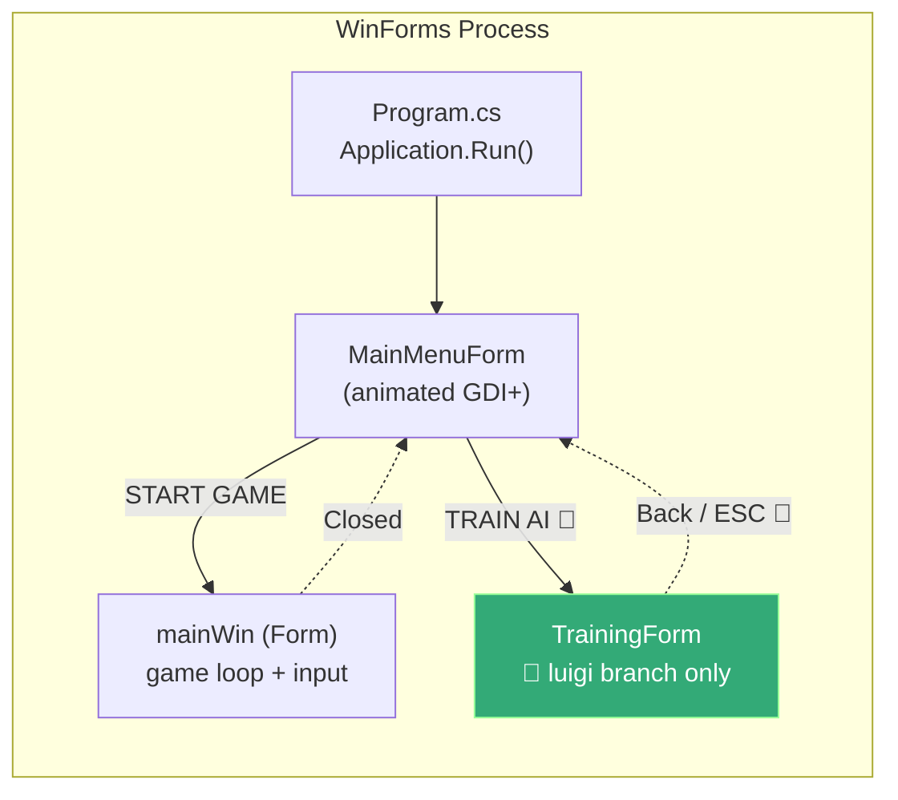
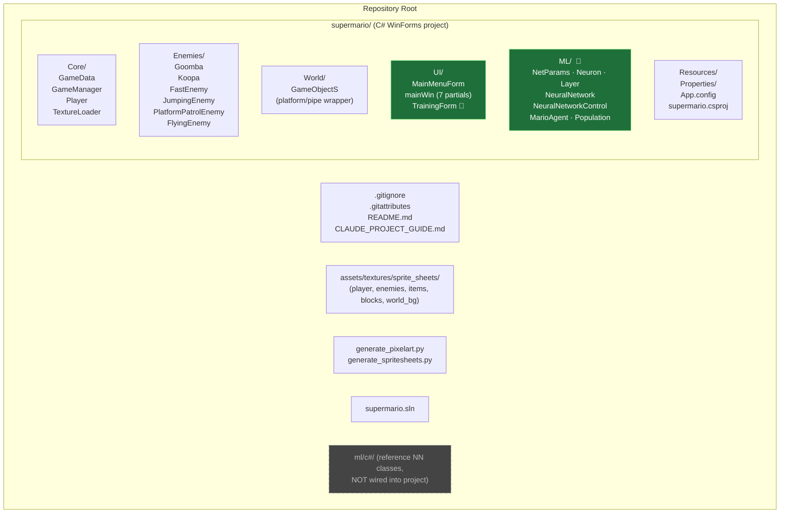
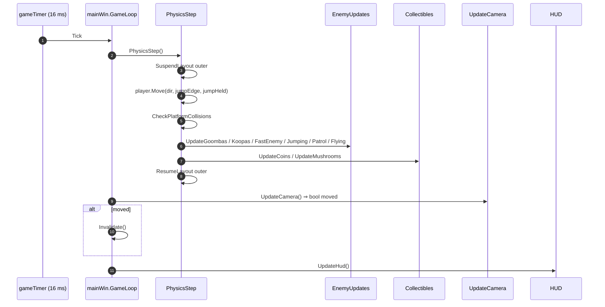
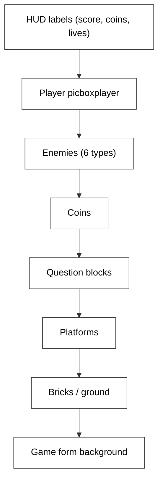
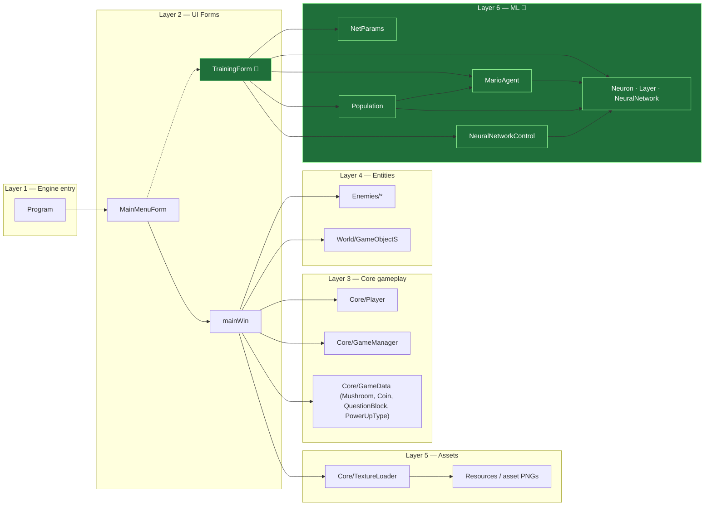
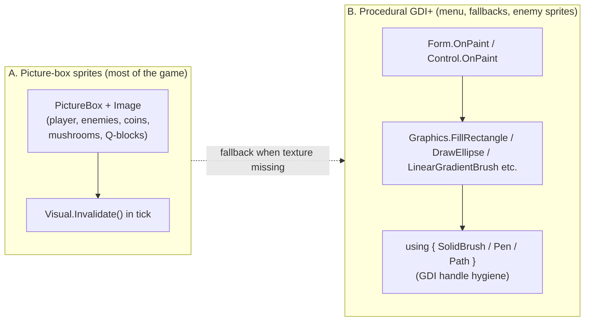
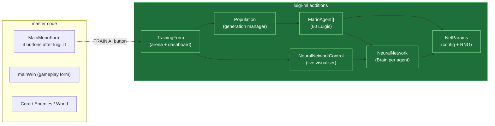

# Architecture

This page maps out **how the SuperMario WinForms game is structured** — on both branches. Where the luigi branch differs from master, it is called out explicitly.

## High-Level Component View

## Folder Layout — Final State

Both branches share this layout; the luigi branch adds `supermario/ML/` and `supermario/UI/TrainingForm.cs`.

## The `mainWin` Partial-Class Fan-Out

`mainWin` was split into 7 partial-class files in commit `4ccef7e` so that each subsystem lives in its own file but compiles into a single class.

```mermaid
classDiagram
  class mainWin {
    Form
    +PhysicsStep()
    +GameLoop()
    +OnKeyDown / OnKeyUp
  }
  class mainWin_LevelData {
    static LEVEL_1[]<br/>LEVEL_2[]<br/>LEVEL_3[]<br/>Q-block defs<br/>Enemy defs<br/>Section templates
  }
  class mainWin_LevelBuilder {
    CreateLongLevel()<br/>ClearPlatforms()<br/>DrawGroundBrick()<br/>DrawPlatformTile()<br/>AddPipe()
  }
  class mainWin_Physics {
    CheckPlatformCollisions()<br/>ResolveSmallestOverlap()<br/>ResolveQBlockOverlap()<br/>ActivateQuestionBlock()<br/>UpdateCamera()<br/>HitByEnemy()
  }
  class mainWin_EnemyUpdates {
    UpdateGoombas()<br/>UpdateKoopas()<br/>UpdateFastEnemies()<br/>UpdateJumping()<br/>UpdatePatrol()<br/>UpdateFlying()
  }
  class mainWin_Collectibles {
    UpdateCoins()<br/>UpdateMushrooms()
  }
  class mainWin_HUD {
    InitHud()<br/>UpdateHud()<br/>DrawPlayerSprite()
  }
  class mainWin_Designer {
    Designer.cs<br/>Dispose()
  }

  mainWin <|.. mainWin_LevelData : partial
  mainWin <|.. mainWin_LevelBuilder : partial
  mainWin <|.. mainWin_Physics : partial
  mainWin <|.. mainWin_EnemyUpdates : partial
  mainWin <|.. mainWin_Collectibles : partial
  mainWin <|.. mainWin_HUD : partial
  mainWin <|.. mainWin_Designer : partial
```

## Game-Loop Tick

Performance hot-spots that were optimised over time:

| Optimization | Commit | Effect |
|---|---|---|
| Single `SuspendLayout` outer pair instead of 7 inner pairs | `8122b3f` | 7×→1× layout passes/tick |
| `UpdateCamera` returns `bool`, skip `Invalidate` when still | `2695fbe` | Removes redundant full-screen repaints |
| `ScrollObjects` early-return on `scroll==0` | `2695fbe` | Skips `SuspendLayout` overhead |
| One 3000 px ground strip vs 75 brick `PictureBox`es | `2695fbe` | Major layout bottleneck removed |
| Opaque `BackColor` on tiles | `5a8c95c` | Eliminates ~75 transparent parent repaints / scroll |
| `globalTick % 168` wrap | `1e82bb3` | Prevents int overflow on long sessions (168 = LCM of animation divisors) |

## Z-Stack (Render Order)

WinForms paints by `Controls` z-order. After commit `be1f398` the order is:

Before that commit, `SendToBack()` was being called by enemy spawn functions *after* every other control had also been `SendToBack`ed, pushing enemies invisibly behind the bricks. Removing those `SendToBack` calls restored visibility; `BringToFront()` on the player keeps it on top.

## Layering / Dependencies

Key property: the ML layer depends only on its own primitives plus a `Point`/`Rectangle` view of the world. It does **not** touch `Player`, `mainWin`, or any of the gameplay enemy classes — the agent re-implements the physics rather than driving the existing `Player` instance.

## GDI+ Drawing Pipeline

The game uses **two** rendering paths:

The fallback is wired by `TextureLoader` (commit `95a0a36`): if `assets/textures/sprite_sheets/*.png` are absent or fail to load, the game silently degrades to GDI+ procedural rendering instead of crashing.

## How the Luigi Branch Plugs In

The integration surface is intentionally tiny: one new button in `MainMenuForm`, the new `TrainingForm`, and the `supermario/ML/` namespace. Nothing in the existing gameplay loop is altered.

## Project File (`supermario.csproj`)

The csproj is a hand-edited classic-style `.csproj`. Each new `.cs` file gets a `<Compile Include="…" />` entry. Big changes:
- `4ccef7e` rewires all paths after the Core/Enemies/World/UI reorganisation.
- `b0bb8dc` adds `UI/MainMenuForm.cs`.
- `4c1bc24` 🌱 adds 12 entries (the 7 ML files + `TrainingForm.cs` + any associated designers).

## Where to Look Next

| You want to understand… | Read |
|---|---|
| The physics constants and how the agent mirrors `Player` | [PHYSICS.md](./PHYSICS.md) |
| All six enemy types | [ENEMIES.md](./ENEMIES.md) |
| Level structure, pipes, Q-blocks, procedural templates | [LEVELS.md](./LEVELS.md) |
| The full master commit history grouped into phases | [master.md](./master.md) |
| Just the Luigi-AI commit and its files | [feature-luigi-ml-training.md](./feature-luigi-ml-training.md) |
| The neuroevolution algorithm in detail | [ml/NEUROEVOLUTION.md](./ml/NEUROEVOLUTION.md) |
