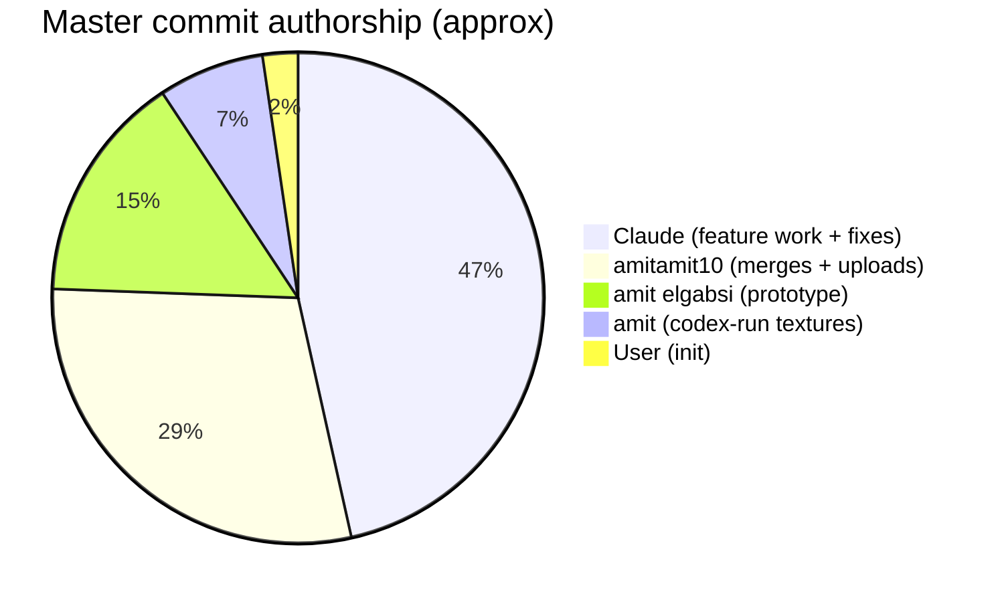
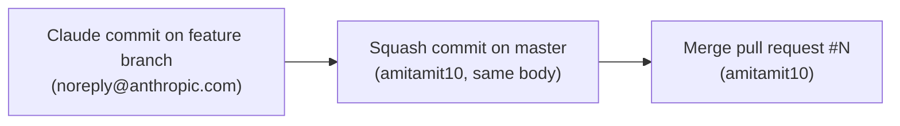

# Contributors

Who built what, across both branches.

## Author Roster

| Author | Identity | Role |
|---|---|---|
| **amit elgabsi** | local commits, mostly placeholder messages | Original prototype scaffolding (Nov 2025 – Apr 2026) |
| **User** | `Add project files.` / `Add .gitattributes and .gitignore.` | Earliest two commits (likely Visual Studio "create project" auto-commits) |
| **amitamit10** | `147654153+amitamit10@users.noreply.github.com` | Repository owner. Authors integration commits, merges PRs, applies upload-style imports. |
| **amit** | local identity used during the `feature/codex-run` work | Texture / sprite-sheet expansion (May 10) |
| **Claude** | `noreply@anthropic.com` | Substantial feature work, refactors, bug fixes, and the Luigi AI engine |

## Commit-Count Distribution

| Author | master commits | luigi-only commits |
|---|---|---|
| Claude | ~40 | 1 (`4c1bc24`) |
| amitamit10 | ~25 (mostly merges + uploads) | 0 |
| amit elgabsi | 13 | 0 |
| amit | 6 | 0 |
| User | 2 | 0 |
| **Total** | **82** | **1** |



## Phase Ownership

```mermaid
flowchart LR
  subgraph A["📦 Scaffolding<br/>Nov 2025 – Apr 2026"]
    A1["amit elgabsi<br/>User"]
  end
  subgraph B["🎮 First playable"]
    B1["Claude<br/>amitamit10"]
  end
  subgraph C["🍄 Mushrooms / Coins"]
    C1["Claude"]
  end
  subgraph D["🏰 Mario architecture"]
    D1["Claude"]
  end
  subgraph E["👾 Enemy variety + reorg"]
    E1["Claude"]
  end
  subgraph F["🎨 Sprite sheets"]
    F1["amit (codex-run)"]
  end
  subgraph G["🛠 Stabilization"]
    G1["Claude<br/>amitamit10 (squash merges)"]
  end
  subgraph H["🦎 Gravity / pit-fall"]
    H1["Claude<br/>amitamit10"]
  end
  subgraph I["🎯 UX / perf"]
    I1["Claude"]
  end
  subgraph J["🐛 Tunneling / merges"]
    J1["Claude<br/>amitamit10"]
  end
  subgraph K["🧹 Resource leaks"]
    K1["Claude<br/>amitamit10"]
  end
  subgraph L["🧠 Luigi AI 🌱"]
    L1["Claude"]
  end
  A1 --> B1 --> C1 --> D1 --> E1 --> F1 --> G1 --> H1 --> I1 --> J1 --> K1 --> L1
```



## Working Patterns Observed

### Squash-merge style

Most Claude-authored commits enter `master` through a PR that gets squash-merged by `amitamit10`. The same body text often appears on:

1. The original `Claude`-authored commit on the feature branch.
2. The same content under `amitamit10` after squash.
3. A `Merge pull request #N` commit by `amitamit10`.

That's why so many commit subjects look duplicated in the log — they are the original, the squash, and the merge commit of the same logical change.



### Claude session IDs

Bodies typically end in a `https://claude.ai/code/session_…` link. Recurring session IDs:

| Session | Commits | Theme |
|---|---|---|
| `01PCN8ojQdjV6BYwzYtEzsfp` | `9bfba3d`, `6f06d18` | First playable / level pass |
| `01MLC27ZJx64jPUL8e4nywyP` | `96aa547`, `ab0eaeb`, `8941a81`, `be1f398`, `b0bb8dc`, `5a8c95c`, `8d32679`, `305e957`, `a647f89` | Mushrooms → arch → sprites |
| `01ULRR1ViDoHc8EG5TKvbXFE` | `0dc6869` | Authentic Mario architecture |
| `011uyQtjU7ghft4acBcqnrso` | `852af7d`, `5ec77bf`, `e03c6e1`, `e56b5b4`, `4ccef7e`, `5eded6a` | Enemy variety + reorg |
| `0144taFxSpvrk7N9QDvE7k76` | `b67a336` | 6 stability bugs |
| `01XLkq3qxRRUThAau8Jf5y6i` | `95a0a36` | Stability sweep |
| `01Umuh9sUC2XpELRSaz1Kbed` | `b1dbdcd`, `02849c0`, `e20b055`, `f5614d3`, `2f461f1`, `1686ab3`, `2695fbe`, `63bb7b1`, **`4c1bc24` 🌱** | Q-block physics + window style + **Luigi AI** |
| `01KhcX1fFRNn1gthQxbrdaDf` | `c8edfbb`, `a673ae3` | Enemy gravity / pit fall |
| `01Px9yGnA5FtVbBBbZiqxgiZ` | `8122b3f`, `9f36fb4` | UX / perf pass |
| `01LG4JHiAT1RXohJA6rQht2f` | `1e82bb3` | Tunneling fixes |
| `01BDDdUuU2S7U13eDLgQXDXf` | `c62e6f6`, `1ebf262` | Merge conflict resolutions |
| `01BLzEX9C7jzC6K7sn7TsaR8` | `3cdb3fe` | Resource leaks fixed |

> Notice that **the Luigi AI commit `4c1bc24` shares a session ID with the Q-block physics + window-style work**. Same Claude-Code session, applied to a different branch.

### Co-authoring style

Several `amitamit10` commits include:

```
Co-authored-by: Claude <noreply@anthropic.com>
```

These are the explicit acknowledgments that the squashed body came from Claude originally.

## Pull-Request Index

| PR # | Branch | Merged by | Theme |
|---|---|---|---|
| 1 | `claude/mario-level-design-upgrade-caQVR` | amitamit10 | First playable level upgrade |
| 2 | `claude/add-mushroom-powerup-bWlNf` | amitamit10 | Mushrooms / coins / enemies |
| 3 | `claude/mario-level-design-upgrade-Yy0yI` | amitamit10 | Mario-style 3-level architecture |
| 4 | `claude/add-enemy-variety-A2sSc` | amitamit10 | 3 new enemy types |
| 5 | `claude/add-enemy-variety-A2sSc` | amitamit10 | Pre-playtest polish |
| 6 | `claude/practical-cannon-Ei05y` | amitamit10 | 6 stability bugs |
| 7 | `codex/refactor-movement-functionality` | amitamit10 | Movement physics rework |
| 14 | `claude/awesome-wright-BtTFz` | amitamit10 | Stability/perf pass |
| 15 | `claude/awesome-wright-ZyJdv` | amitamit10 | Stability fixes |
| 16 | `claude/awesome-wright-oEUy8` | amitamit10 | Stability fixes |
| 17 | `claude/repo-recovery-stabilization-A1iDX` | amitamit10 | Q-block physics + window style |
| 18 | `codex/refactor-movement-functionality-n412m5` | amitamit10 | Movement refactor follow-up |
| 19 | `testing` | amitamit10 | Testing-branch merge |
| 20 | `claude/intelligent-tesla-HiZB5` | amitamit10 | Resource leaks fixed |

The luigi-ml branch never went through a PR — it's a direct branch off master with one commit on top.
