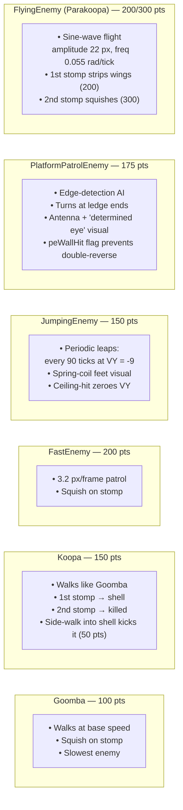
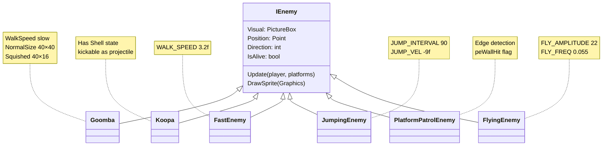
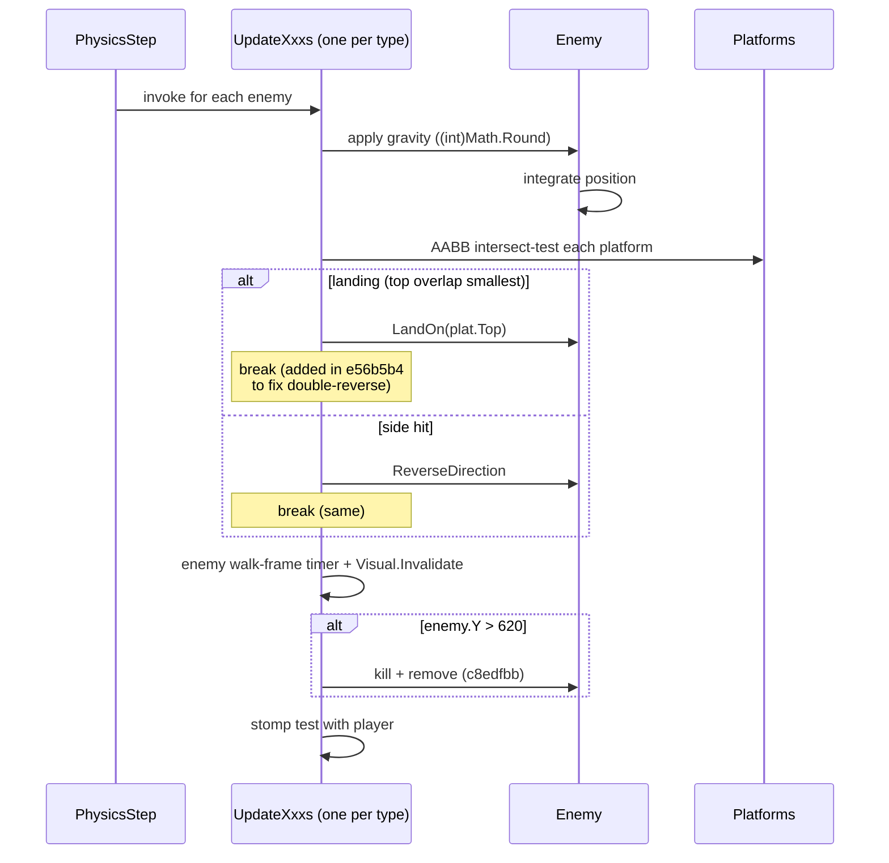
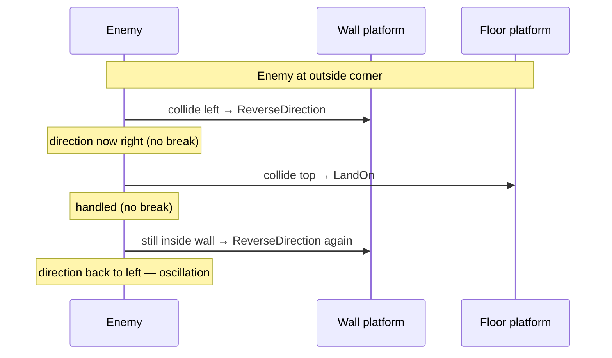

# Enemies

Six enemy types are wired into the game by the time master reaches its current tip. All six live in `supermario/Enemies/*.cs` (one file per class) after the reorganisation in commit `4ccef7e`.

## Catalogue



## Class Hierarchy



> `IEnemy` is conceptual — the master codebase doesn't actually share a formal interface; it duplicates the loop across `UpdateGoombas` … `UpdateFlying` in `mainWin.EnemyUpdates.cs`. The interface above is a documentation convenience.

## Update Loop (Generic)

Every enemy follows essentially the same physics flow inside its `UpdateXxx` method:



Stomp detection requires `player.VerticalVelocity >= 0` (commit `95a0a36`) so jumping *up* through an enemy's head doesn't false-trigger a stomp.

## Per-Enemy Details

### Goomba
- The original enemy; walks at base WalkSpeed, reverses on wall collision.
- Squished sprite is half height; the squish state early-outs **before** gravity (commit `b67a336`) so a dead Goomba doesn't accumulate gravity and jitter 1 px.
- All GDI brushes / paths in `Goomba.cs` wrapped in `using` (commit `6f06d18`) to plug resource leaks.

### Koopa
- Green turtle. First stomp transitions to **shell state** — same physics but with a different sprite and 0 walk speed.
- Walking sideways into a *dormant* shell now kicks it (50 pts, commit `3cdb3fe`) instead of hurting the player.
- Lives at L1–L3 X positions `{750, 1350, 1700, 2300}`.

### FastEnemy
- Red, fast (3.2 px/tick). Same shape as Goomba but with a different palette.
- Lives at L1–L3 X positions `{1100, 1800, 2400}`.

### JumpingEnemy
- Blue. Periodic leap every 90 ticks at `VY = -9f`. Spring-coil feet visual cue right before the leap.
- Ceiling-hit while airborne now zeroes `VY` instead of clipping through (commit `1e82bb3`).
- The jump timer only advances while grounded. A grounded enemy resting exactly on a platform top (`bottom == platformTop`) is *not* an `IntersectsWith` overlap, which used to clear `IsGrounded` every other frame and halve the real cadence (~3 s instead of ~1.5 s). A short downward footing probe now keeps `IsGrounded` stable so the 90-tick cadence holds.
- Stomp score: **150**.

### PlatformPatrolEnemy
- Orange. Has edge-detection AI: when its foot crosses past the platform edge, it reverses direction *before* walking off.
- `peWallHit` flag (commit `e56b5b4`) prevents edge-detection from cancelling a wall reversal on the same frame.
- Antenna-tip `SolidBrush` wrapped in `using` (commit `5ec77bf`) for GDI hygiene.
- Stomp score: **175**.

### FlyingEnemy (Parakoopa)
- Green, sine-wave flight: `amplitude = 22 px`, `freq = 0.055 rad/tick`.
- Originally amplitude `28`, reduced to `22` in `5ec77bf` to stop clipping through platform undersides.
- **First stomp** strips wings → falls to ground physics (worth **200 pts**).
- **Second stomp** squishes the resulting walker (worth **300 pts**).

## Direction-Reversal Bug History

In commit `e56b5b4` all six enemy `Update` methods were patched to insert `break` after `ReverseDirection()` in their platform-collision `foreach` loops. Without it, an enemy touching two surfaces simultaneously (wall + platform corner) got reversed twice per frame and **oscillated in place**. The mushroom already had this `break`; the fix brought enemies in line.



After the fix:
```mermaid
sequenceDiagram
  participant E as Enemy
  participant W as Wall platform
  participant F as Floor platform

  E->>W: collide left → ReverseDirection + **break**
  Note over E: loop exits cleanly; next tick resumes
```

## Score Table

| Enemy | Stomp | Notes |
|---|---|---|
| Goomba | 100 | |
| FastEnemy | 200 | |
| Koopa | 150 | First stomp shells, second kills |
| Koopa shell kick | 50 | Side walk into dormant shell (3cdb3fe) |
| JumpingEnemy | 150 | |
| PlatformPatrolEnemy | 175 | |
| FlyingEnemy (wing strip) | 200 | |
| FlyingEnemy (squish) | 300 | After wings stripped |

## Where They Live

- Per-level placement uses **`EnemyDef`** arrays (commit `0dc6869`), with three hand-placed arrays for L1, L2, L3, plus a default-fallback array used by procedural levels 4-5.
- Pre-playtest polish (commit `5ec77bf`) fixed 6 out-of-bounds spawn positions across L1–L3 and moved L1 patrol enemies onto bridge/rest platforms where their edge-turn AI is more visible.
