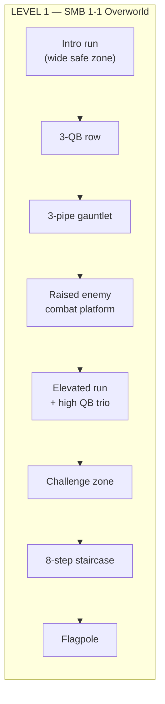
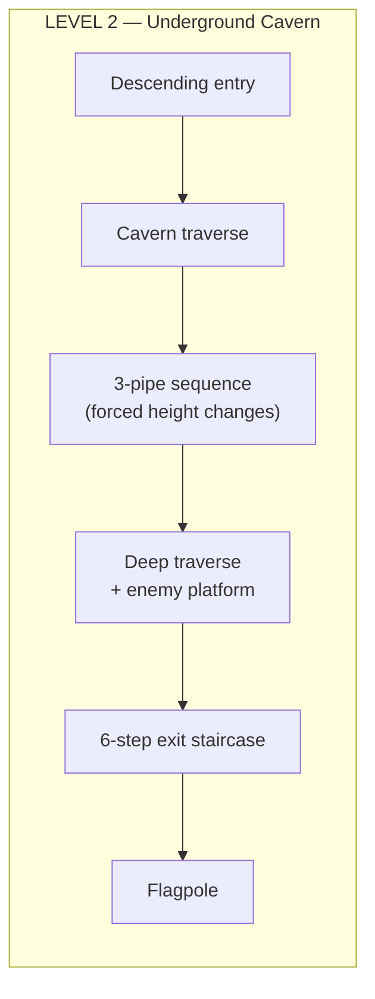
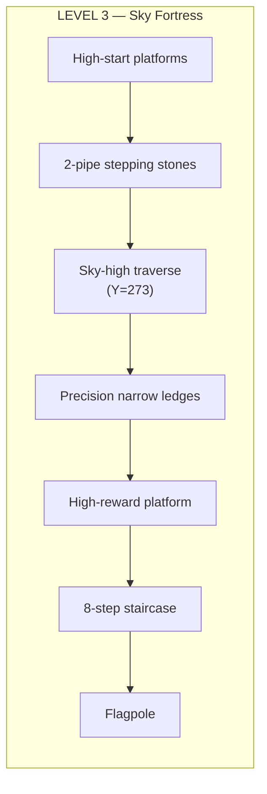
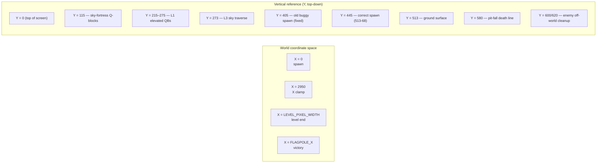
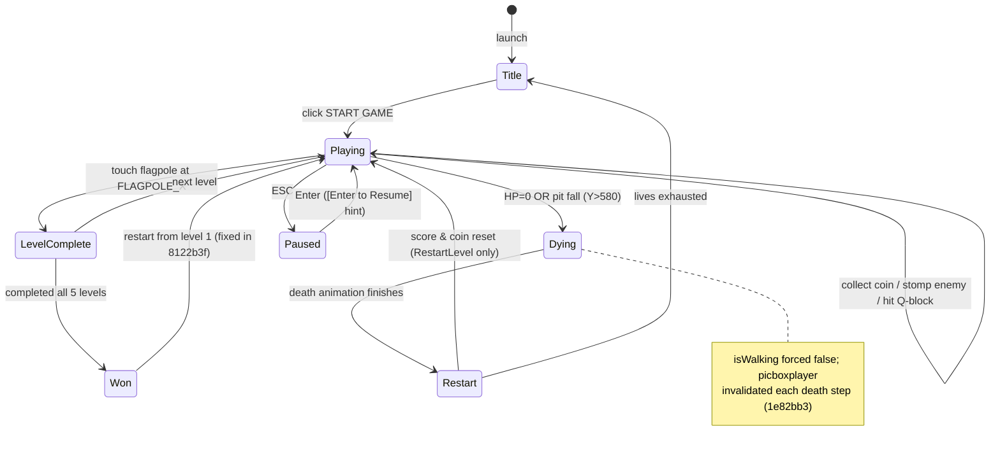
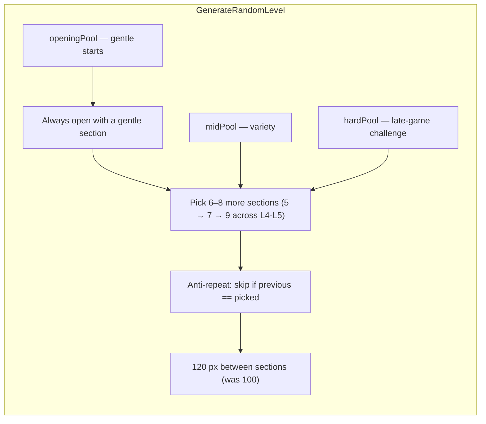
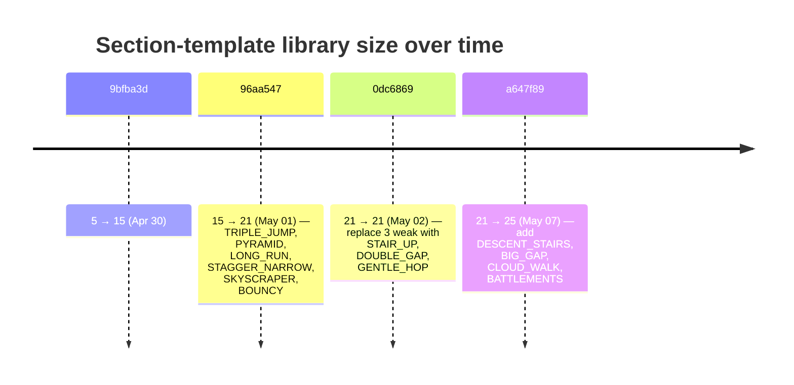
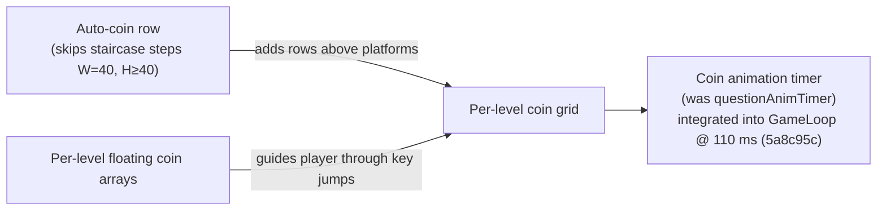
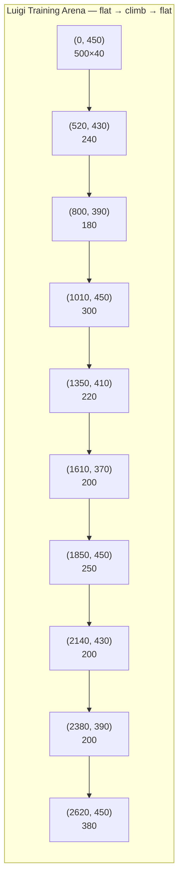

# Level Design

The game ships with **three hand-designed levels** (L1–L3) and **two procedural levels** (L4–L5) generated from a library of 25 section templates. Both branches share the same level system; the luigi branch adds its own separate flat training arena inside `TrainingForm`.

## The Three Hand-Designed Levels







## Coordinates & World Bounds



Camera: `CAMERA_MAX` prevents scrolling past the level boundary (`6f06d18`).

## Win / Lose / Restart Flow



Key fixes:
- `_levelComplete` flag prevents double-trigger (`6f06d18`).
- All 5 levels completed ⇒ restart from L1, not L5 (`8122b3f`).
- `gameTimer.Stop()` before `Start` in `DoLevelSetup` (`1e82bb3`).
- Score / coinCount only reset in `RestartLevel`, not `DoLevelSetup` (`ab0eaeb`).

## Question-Block Math

Vertical placement formula used everywhere after `e20b055`:

```
block_Y = platform_Y − player_height(68) − clearance(40) − block_height(50)
```

This positions the Q-block so its bottom edge floats **40 px** above the standing player's head — the player walks freely beneath, but a jump brings them up into it.

Applied recalculations:
| Level | Old Y | New Y | Reason |
|---|---|---|---|
| L1 row above Y=433 | 353 | **275** | Stand-clearance |
| L1 above Y=393 platform | 313 | **235** | Same |
| L1 above Y=393 run | 273 | **235** | Same |
| L1 above Y=373 challenge | 333 | **215** | Same |
| L2 | various | per-platform | Same formula applied to all 8 |
| L3 sky | various | **Y=115** above Y=273 | Multi-step climb retained |

## Procedural Sections (L4–L5)

`GenerateRandomLevel` composes the level out of section templates picked from three pools:



The 25 templates (final state on master HEAD):

| # | Section | Pool |
|---|---|---|
| 1 | STAIRS | opening |
| 2 | GENTLE_HOP | opening |
| 3 | LEDGE_HOP | opening |
| 4 | WIDE_GAPS | opening |
| 5 | WAVE | opening |
| 6 | DESCEND | mid |
| 7 | BRIDGE | mid |
| 8 | ZIGZAG | mid |
| 9 | ARCH | mid |
| 10 | SUSPENDED | mid |
| 11 | VALLEY | mid |
| 12 | MULTI_LEVEL | mid |
| 13 | CASTLE | mid |
| 14 | STAIR_UP | mid |
| 15 | DOUBLE_GAP | mid |
| 16 | TRIPLE_JUMP | mid |
| 17 | PYRAMID | mid |
| 18 | LONG_RUN | mid |
| 19 | DESCENT_STAIRS | mid (a647f89) |
| 20 | BIG_GAP | mid (a647f89) |
| 21 | BATTLEMENTS | mid (a647f89) |
| 22 | STAGGER_NARROW | replaced 0dc6869 |
| 23 | SKYSCRAPER | replaced 0dc6869 |
| 24 | BOUNCY | replaced 0dc6869 |
| 25 | CLOUD_WALK | hard (a647f89) |

(Replaced sections are still defined in code but moved out of active pools.)

### Section evolution timeline



## Pipes

Added in commit `0dc6869`:
- `AddPipe()` + `DrawPipeTile()` render authentic green Mario pipes with a wide rim head and inset body with a highlight stripe.
- Side-collision in `CheckPlatformCollisions()` blocks the player horizontally when approaching from the side — pipes are real obstacles, not decoration.
- Per-level arrays (`LEVEL_1_PIPES`, `LEVEL_2_PIPES`, `LEVEL_3_PIPES`).
- Procedural levels (L4-L5) have **no pipes** by design.

## Coins



A coin gives **+10 score** and **+1 coinCount**. Coin Q-blocks give **+50 score** and **+1 coin** on first hit.

## Training Arena (luigi branch only)

`TrainingForm` builds a *separate* flat-ish strip of 10 platforms used only for AI training:

```csharp
private static readonly (int x, int y, int w, int h)[] TRAIN_PLATFORMS = {
    (0,    450, 500, 40),  (520,  430, 240, 40), (800,  390, 180, 40),
    (1010, 450, 300, 40),  (1350, 410, 220, 40), (1610, 370, 200, 40),
    (1850, 450, 250, 40),  (2140, 430, 200, 40), (2380, 390, 200, 40),
    (2620, 450, 380, 40),
};
private static readonly Point SPAWN = new Point(30, 350);
```



This is an intentionally simple level — no enemies, no Q-blocks, no pipes, no coins. Just gaps to jump and platform-height differences to climb so the four agent inputs (`gapDist`, `enemyDist`, `heightDiff`, `isGrounded`) have meaningful signal.

Spawn `Y = 350` puts the agent in the air, so it falls onto the first platform on the very first tick — every Luigi starts with the same air-frame.
