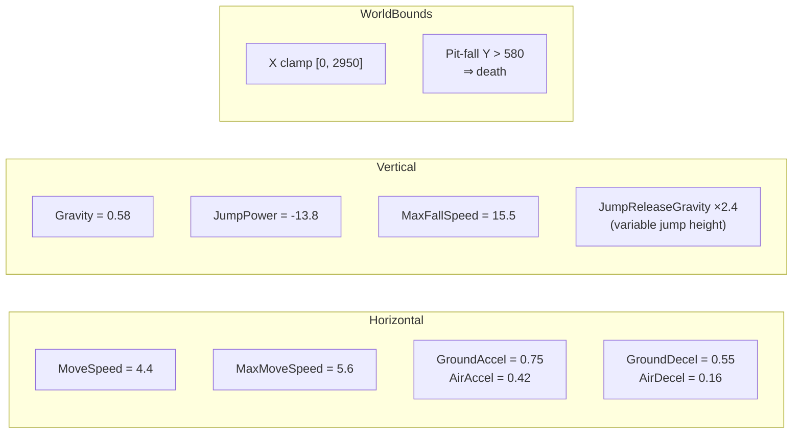
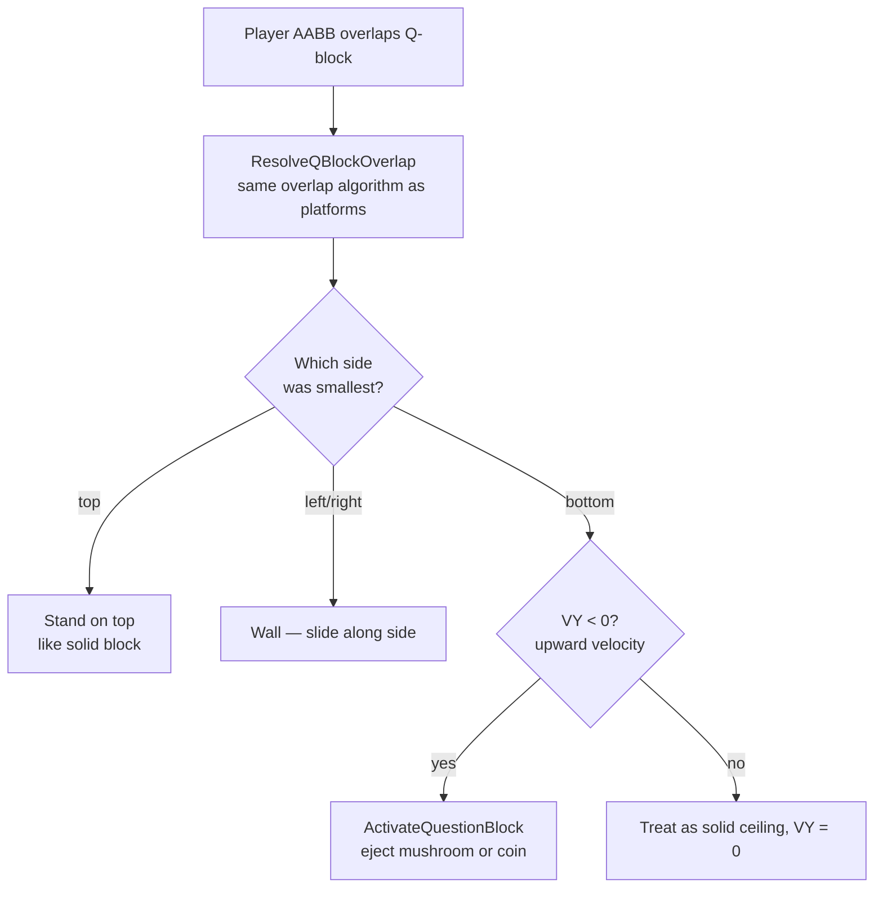
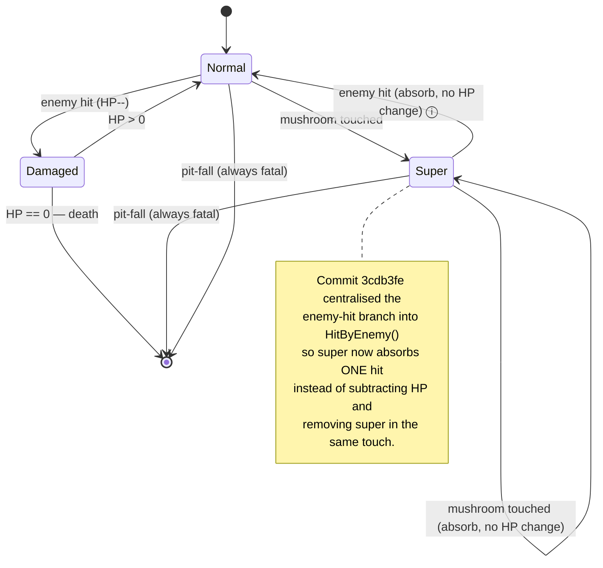

# Physics

This page documents the physics model used by both `Player` (master) and `MarioAgent` (luigi). They share **identical constants and integration order** — by design — so that the AI experiences the exact same world the human player does.

## Shared Constants



All values are in **pixels per tick** at the 16 ms `gameTimer.Interval` (~60 Hz). Acceleration values are in pixels/tick².

## Per-Tick Integration Order

This is the same on both `Player.Move` and `MarioAgent.Step`:

```mermaid
flowchart TD
  A[direction in -1/0/+1<br/>jumpPressed: bool<br/>jumpHeld: bool] --> B
  B[Approach horizontalVelocity toward<br/>direction × MoveSpeed<br/>using GroundAccel or AirAccel] --> C
  C[Clamp to ±MaxMoveSpeed] --> D
  D[preciseX += horizontalVelocity<br/>clamp X to 0…2950] --> E
  E{jumpPressed AND<br/>IsGrounded?}
  E -->|yes| F[VerticalVelocity = JumpPower<br/>IsGrounded = false]
  E -->|no| G[—]
  F --> H
  G --> H
  H[jumpHeld = jumpHeld input]
  H --> I{IsGrounded?}
  I -->|no| J["g = Gravity<br/>if !jumpHeld AND VY<0:<br/>  g *= 2.4 (release-cut)<br/>VY = min(VY + g, MaxFall)<br/>preciseY += VY"]
  I -->|yes| K[VerticalVelocity = 0]
  J --> L
  K --> L
  L[Position = round(preciseX, preciseY)]
```

Notable details:
- **Variable jump height** comes from cutting the rise short with a 2.4× gravity multiplier when the jump key is released *while still moving up*.
- **Precise float positions** (`preciseX`, `preciseY`) are kept alongside integer `Position` so sub-pixel movement isn't truncated frame-to-frame.
- **Sub-pixel speed bug**: an early build truncated `(int)velocity`, which made gravities < 1.0 produce zero movement per tick — enemies would hover before falling. Fixed by switching to `(int)Math.Round(velocity)` in commit `c8edfbb`.

## `Approach` Helper

```csharp
static float Approach(float v, float t, float a) {
    if (v < t) return Math.Min(v + a, t);
    if (v > t) return Math.Max(v - a, t);
    return v;
}
```

This produces smooth acceleration toward `t` at rate `a` without overshooting. Used both for accelerating from rest and decelerating on no-input.

## Player vs MarioAgent: Side-By-Side

| Property | `Core/Player` (master) | `ML/MarioAgent` 🌱 |
|---|---|---|
| Namespace | `supermario` | `supermario.ML` |
| Gravity | `0.58f` | `0.58f` |
| JumpPower | `-13.8f` | `-13.8f` |
| MaxFallSpeed | `15.5f` | `15.5f` |
| MoveSpeed | `4.4f` | `4.4f` |
| MaxMoveSpeed | `5.6f` | `5.6f` |
| GroundAccel/Decel | `0.75 / 0.55` | `0.75 / 0.55` |
| AirAccel/Decel | `0.42 / 0.16` | `0.42 / 0.16` |
| Jump-release multiplier | `2.4×` | `2.4×` |
| World X clamp | `0…2950` | `0…2950` |
| Receives input from | Keyboard | NN `outputs` via `Think()` |
| Has health / lives | Yes (3 HP, super state) | No (just alive/dead) |
| Death conditions | enemy hit, pit fall, fall damage | pit fall, **stuck timer** |
| Sprite path | PictureBox + texture/fallback | Procedural GDI+ Luigi |

## Stuck Detection (Luigi Only)

`MarioAgent.Step` adds a stuck-detection that has no analogue in `Player`:

```csharp
stuckTimer++;
if (stuckTimer >= 120)            // every 2 s at 60 Hz
{
    if (Math.Abs(Position.X - lastX) < 8) IsAlive = false;
    lastX      = Position.X;
    stuckTimer = 0;
}
```

This is essential during evolution: an agent that has its brain wired to "hold left forever" or "never jump" would otherwise sit at the spawn forever, blocking the generation from advancing. After ~2 seconds of < 8 px X-movement the agent is killed and its fitness frozen.

## Collision Resolution — `ResolveSmallestOverlap`

When a moving body's AABB overlaps a platform, the engine picks the **smallest of the four overlap distances** (top, bottom, left, right) and pushes the body out along that axis. The same algorithm runs for player–platform, enemy–platform, mushroom–platform, and (in the luigi arena) agent–platform.

```mermaid
flowchart LR
  S[Bounds overlap?] -->|no| E["return (no collision)"]
  S -->|yes| O[Compute four overlaps:<br/>ot = body.Bottom - plat.Top<br/>ob = plat.Bottom - body.Top<br/>ol = body.Right - plat.Left<br/>orr = plat.Right - body.Left]
  O --> M[min = min4 of overlaps]
  M --> T{min == ot?}
  T -->|yes & ot < 30| LAND["LandOn(plat.Top)"]
  M --> B{min == ob?}
  B -->|yes| CEIL[HitCeiling, VY = 0]
  M --> L{min == ol?}
  L -->|yes| WALL_L[BlockHorizontal (left side)]
  M --> R{min == orr?}
  R -->|yes| WALL_R[BlockHorizontal (right side)]
```

Edge cases that have been patched over time:
- `ot` threshold raised **25 → 30 px** in `1e82bb3` so 15 px/step max-fall velocity can't tunnel through floor platforms.
- Ceiling branch no longer gated on `VY < 0` (`95a0a36`); upward-corner case explicitly treated as ceiling hit instead of sideways push.
- Q-blocks now go through the same resolver but bottom-overlap also triggers `ActivateQuestionBlock` (`e20b055`).

## Question-Block Physics (Master)

Authentic SMB rules added in `e20b055`:



Vertical placement of every Q-block uses:

```
block_Y = platform_Y - player_height(68) - clearance(40) - block_height(50)
```

…so a Q-block always floats 40 px above the player's head when the player is standing on the platform below. Player walks freely beneath; only a jump reaches it.

## Fall Damage

Tracked across all branches:

| Threshold | Effect | Commit |
|---|---|---|
| Originally `60f` | Triggered on every normal jump (bug) | — |
| Raised to `120f` | Fixed false-positives, still felt punishing | `5a8c95c` |
| Raised to `220f` | Intended platform drops no longer cost a heart | `3cdb3fe` |

Pit-fall death (Y > 580) is separate from fall-damage and always fatal.

## The Super Power-Up Lifecycle



`BecomeSuper`/`BecomeNormal` adjust the player's height by the real **14 px** delta (commit `3cdb3fe`) — previously a hard-coded 16 caused 2 px ground embed when shrinking and 2 px float when growing.

## Key Commits

| Commit | Physics change |
|---|---|
| `9bfba3d` | `wasGroundedLastFrame=true` at init/reset — fix spawn fall-damage |
| `ab0eaeb` | Use `Visual.Height` for squished goombas; pit Y > 580 detection |
| `b67a336` | Edge-triggered `jumpEdge` so holding through landing doesn't auto-fire |
| `95a0a36` | `VerticalVelocity >= 0` guard on stomp; ceiling-branch always fires |
| `2695fbe` | `PLAYER_START_X` / `GROUND_TOP_Y` constants; spawn Y fix 405→445 |
| `c8edfbb` | `(int)Math.Round(velocity)` for enemy/mushroom gravity |
| `e20b055` | Solid-physics Q-blocks; activate only on upward bottom hit |
| `1e82bb3` | Landing-overlap 25→30; ceiling hit on JumpingEnemy while airborne |
| `3cdb3fe` | Super absorbs hit; 14 px shrink delta; fall threshold 120→220; HitByEnemy() helper |
