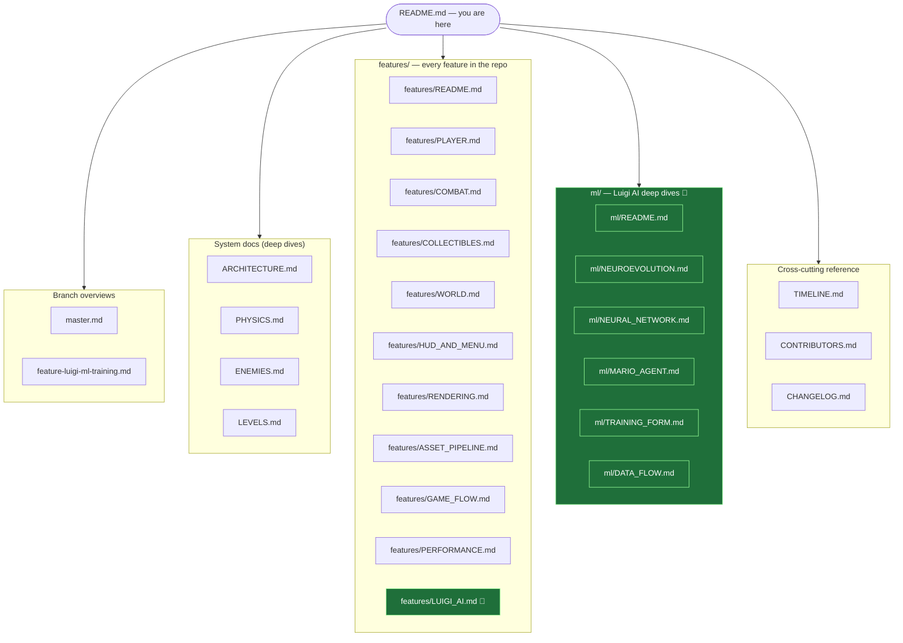
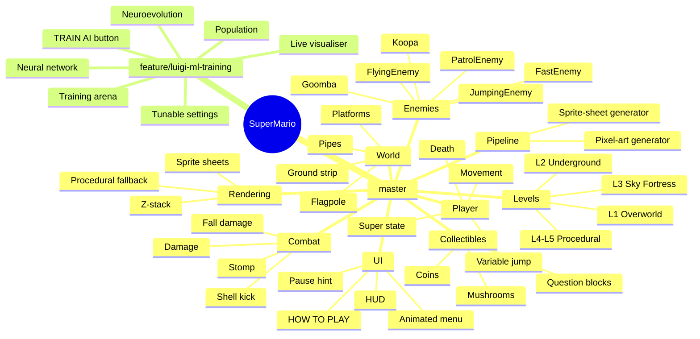
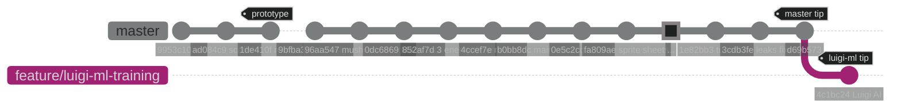

# SuperMario — Branch Documentation 📚

Welcome to the documentation hub for the two active development tracks of the SuperMario WinForms game:

- **`master`** — the stable, integrated mainline.
- **`feature/luigi-ml-training`** — adds a self-learning Luigi AI via neuroevolution on top of `master`.

> Other branches in the repository (`testing`, `texture-pack-final`, `claude/intelligent-tesla-HiZB5`, `claude/document-luigi-branches-35rZm`) are intentionally excluded from these docs.

---

## Site Map

## At-a-Glance Feature Map

## Branch Relationship

---

## Pages in This Documentation

### 🌳 Branch overviews
| Page | Description |
|------|-------------|
| **[master.md](./master.md)** | The 82-commit `master` history, grouped into 12 themed phases, with full file layout and per-commit table. |
| **[feature-luigi-ml-training.md](./feature-luigi-ml-training.md)** | The +1 commit on top of master and a tour of `supermario/ML/`. |

### 🏗 Deep-dive system docs
| Page | Description |
|------|-------------|
| **[ARCHITECTURE.md](./ARCHITECTURE.md)** | Project layout, layering, partial-class fan-out, control z-stack, GDI+ pipeline. |
| **[PHYSICS.md](./PHYSICS.md)** | All physics constants, side-by-side `Player` vs `MarioAgent`, collision resolution algorithm. |
| **[ENEMIES.md](./ENEMIES.md)** | Catalogue of all 6 enemy types with stomp values, AI, and visual identity. |
| **[LEVELS.md](./LEVELS.md)** | Level architecture, 25 procedural section templates, Q-block math, pipe rules, luigi training arena. |

### 📦 Feature catalogue
| Page | Description |
|------|-------------|
| **[features/README.md](./features/README.md)** | Index of every game feature. |
| [features/PLAYER.md](./features/PLAYER.md) | Movement, variable jump, spawn, death, super state. |
| [features/COMBAT.md](./features/COMBAT.md) | Stomp, damage, super-absorbs-hit, shell kick, fall damage. |
| [features/COLLECTIBLES.md](./features/COLLECTIBLES.md) | Coins, mushrooms, question blocks (solid-physics activation). |
| [features/WORLD.md](./features/WORLD.md) | Platforms, ground strip, pipes, flagpole, backgrounds. |
| [features/HUD_AND_MENU.md](./features/HUD_AND_MENU.md) | Animated menu, HOW TO PLAY overlay, in-game HUD, pause UX, window style. |
| [features/RENDERING.md](./features/RENDERING.md) | Sprite sheets, TextureLoader, procedural GDI+ fallback, z-stack. |
| [features/ASSET_PIPELINE.md](./features/ASSET_PIPELINE.md) | The Python generators: `generate_pixelart.py` and `generate_spritesheets.py`. |
| [features/GAME_FLOW.md](./features/GAME_FLOW.md) | Title → Play → Die → Restart → Level Complete → Win → Title state machine. |
| [features/PERFORMANCE.md](./features/PERFORMANCE.md) | Every perf optimisation in one place. |
| [features/LUIGI_AI.md](./features/LUIGI_AI.md) 🌱 | The full Luigi AI feature surface. |

### 🧠 Luigi-ML deep dives
| Page | Description |
|------|-------------|
| **[ml/README.md](./ml/README.md)** | Entry point to the ML docs. |
| [ml/NEUROEVOLUTION.md](./ml/NEUROEVOLUTION.md) | Full generational-evolution algorithm with diagrams. |
| [ml/NEURAL_NETWORK.md](./ml/NEURAL_NETWORK.md) | Neuron / Layer / Network class structure and forward pass. |
| [ml/MARIO_AGENT.md](./ml/MARIO_AGENT.md) | Luigi agent: physics mirror, 4-input sensors, stuck-detection, fitness. |
| [ml/TRAINING_FORM.md](./ml/TRAINING_FORM.md) | Arena, dashboard, settings, controls. |
| [ml/DATA_FLOW.md](./ml/DATA_FLOW.md) | Sequence diagram of a single training tick. |

### 🗓 Cross-cutting reference
| Page | Description |
|------|-------------|
| [TIMELINE.md](./TIMELINE.md) | Gantt-style chronological view of all phases. |
| [CONTRIBUTORS.md](./CONTRIBUTORS.md) | Authors and their contributions, session IDs, PR index. |
| [CHANGELOG.md](./CHANGELOG.md) | One-line summary per commit, both branches. |

---

## Quick Facts

| | master | feature/luigi-ml-training |
|---|---|---|
| **Tip commit** | `d69b573` | `4c1bc24` |
| **Total commits** | 82 | 83 |
| **Unique commits** | 82 (all) | 1 |
| **Lines added vs base** | — | +1,105 / -1 |
| **New folders** | — | `supermario/ML/` |
| **New main-menu buttons** | 3 | 4 (adds TRAIN AI) |
| **Game playable?** | Yes | Yes |
| **Self-learning Luigi?** | No | Yes |

## Recommended Reading Order

For a first-time reader:

1. **[features/README.md](./features/README.md)** — see the full feature map.
2. **[ARCHITECTURE.md](./ARCHITECTURE.md)** — orient in the codebase.
3. **[features/PLAYER.md](./features/PLAYER.md)** → **[features/COMBAT.md](./features/COMBAT.md)** → **[features/COLLECTIBLES.md](./features/COLLECTIBLES.md)** → **[features/WORLD.md](./features/WORLD.md)** → **[ENEMIES.md](./ENEMIES.md)** → **[LEVELS.md](./LEVELS.md)** — the gameplay tour.
4. **[features/HUD_AND_MENU.md](./features/HUD_AND_MENU.md)** → **[features/GAME_FLOW.md](./features/GAME_FLOW.md)** → **[features/RENDERING.md](./features/RENDERING.md)** → **[features/ASSET_PIPELINE.md](./features/ASSET_PIPELINE.md)** → **[features/PERFORMANCE.md](./features/PERFORMANCE.md)** — supporting systems.
5. **[features/LUIGI_AI.md](./features/LUIGI_AI.md)** then **[ml/README.md](./ml/README.md)** → the ML deep-dive pages.
6. **[master.md](./master.md)** and **[feature-luigi-ml-training.md](./feature-luigi-ml-training.md)** for the commit-by-commit history.
7. **[TIMELINE.md](./TIMELINE.md)**, **[CONTRIBUTORS.md](./CONTRIBUTORS.md)**, **[CHANGELOG.md](./CHANGELOG.md)** as references.

## Page Count

| Section | Files |
|---|---|
| Branch overviews | 2 |
| System deep dives | 4 |
| Feature catalogue | 10 (+ index) |
| ML deep dives | 5 (+ index) |
| Cross-cutting reference | 3 |
| **Total** | **27 pages** |
