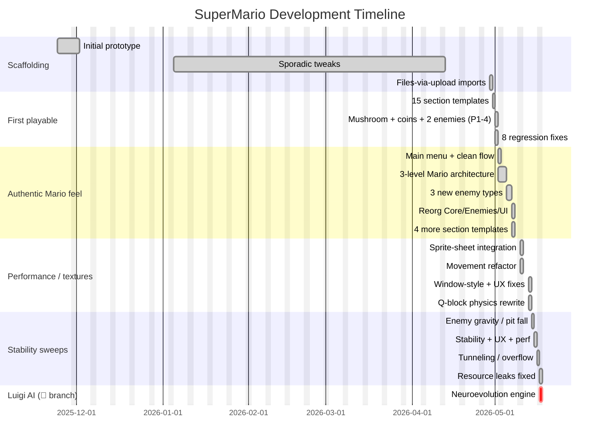
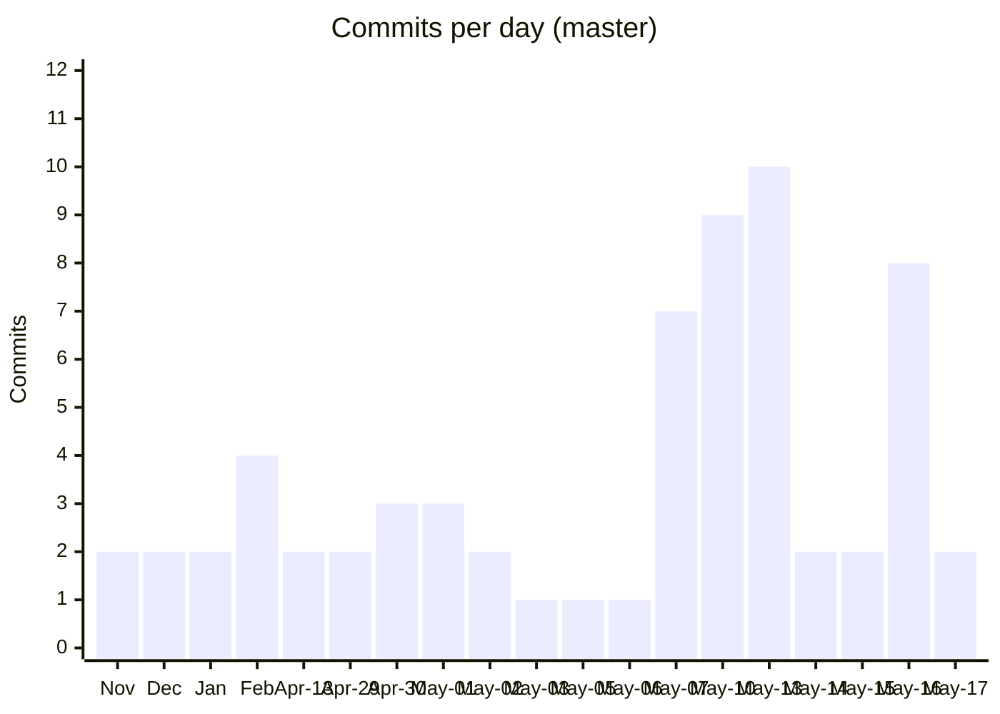

# Project Timeline

Chronological view of when each phase happened, who drove it, and which commits anchor it. Useful when reading a commit and you want to know *what else was going on that week*.

## Big-Picture Gantt



## Commits Per Day



The big spikes line up with the major themed phases (May 7 reorganisation, May 10 sprite-sheet + perf, May 13 Q-block rewrite, May 16 merge frenzy).

## Phase Index

### 📦 Phase A — Scaffolding (Nov 2025 – Apr 2026)
- `9953c10` Add `.gitattributes` / `.gitignore` (2025-11-24)
- `ad084c9` Add project files (2025-11-24)
- `1de410f` "improved from almost scratch#" (2025-12-01)
- `130df6c` test (2025-12-01)
- `2eebbde` fixed some stuff (2026-01-05)
- `6c36f28` update ident (2026-01-05)
- Placeholder-message commits Feb–Apr: `9a1ddcb`, `ebf9fcd`, `f79c509`, `3531fc0`, `29ca404`, `7782ed2`, `0c4c3a2`, `482715d`, `93981fb`
- `a9dc802`, `d5b87c1` Add files via upload (2026-04-29)

### 🎮 Phase B — First Playable Level Pass (Apr 30 2026)
- `9bfba3d` 15 section templates, redesigned L1/L2
- `6506174` PR #1 merge
- `6f06d18` Bug-fix merge + remove duplicate `supermario-master` folder

### 🍄 Phase C — Mushrooms, Coins, Enemy Variety, L4 (May 1 2026)
- `96aa547` Add Phases 1-4 (mushrooms, coins, Koopa, FastEnemy)
- `1f9cc95` PR #2 merge
- `ab0eaeb` Fix 8 regression bugs
- `8941a81` Merge regression fixes
- `be1f398` Fix enemy invisibility (SendToBack)

### 🏰 Phase D — Authentic Mario Architecture (May 2-3 2026)
- `b0bb8dc` Polished animated main menu
- `0dc6869` 3-level Mario-style architecture, pipes, per-level QBlockDef/EnemyDef
- `d6ac9d3` PR #3 merge

### 👾 Phase E — Enemy Variety Expansion (May 5-7 2026)
- `852af7d` Add JumpingEnemy / PlatformPatrolEnemy / FlyingEnemy
- `1e6f566`, `0e5c2cd` PR #4/#5 merges
- `5ec77bf` Pre-playtest polish: spawn fixes, GDI leak, FLY_AMPLITUDE 28→22
- `57bd99c` Merge `claude/add-enemy-variety-A2sSc`
- `e03c6e1` Remove dead code (`GameManager` slim + `gameObject.cs` deleted)
- `e56b5b4` Fix enemy direction-reversal bugs (break missing)
- `4ccef7e` 🔁 Big reorg: Core/Enemies/World/UI + 7 mainWin partials
- `5eded6a` docs: Mermaid flowcharts in README
- `a647f89` +4 section templates → 25 total

### 🎨 Phase F — Sprite Sheets & Texture Integration (May 10 2026)
- `912e343` Setup texture expansion branch
- `ddcf56c` Generate authentic procedural pixel-art
- `2e9b06e` Generate multi-frame sprite sheets
- `d500ae6` Animation refinement
- `acaf8a3` Codex run integration
- `fa809ae` Merge feature/codex-run
- `2faf474` Merge origin/master into feature/codex-run
- `5a8c95c`, `8d32679` Port perf/bug fixes to master
- `305e957` Mono compatibility (no C# 7 tuple deconstruction)
- `b67a336` 6 stability/gameplay/perf bugs (Q-block guard, edge-trigger jump, etc.)
- `53171da` PR #6 merge
- `ee5d8b3`, `7f0b8d4`, `67bf653`, `6a3a336` Movement-physics rework, floor/scrolling perf, camera tightening

### 🛠️ Phase G — Stabilization Sweep (May 13 2026)
- `95a0a36` Stability, gameplay, collision fixes (TextureLoader try/catch, stomp VY guard, ResolveSmallestOverlap ceiling)
- `63bb7b1`, `2695fbe` Consolidate best improvements: `UpdateCamera` bool, 75 bricks→1 strip, `PLAYER_START_X`/`GROUND_TOP_Y`, spawn Y fix 405→445
- `56866cb`, `7b39976` Periodic merges back to master
- `1686ab3`, `2f461f1` Dead walk-frame code removal, mushroom memory leak fix
- `f5614d3`, `e20b055` Authentic Q-block physics + level redesign
- `02849c0`, `b1dbdcd` Window-style: borderless, no desktop flash
- `cdd0ba5` Add `ml/` folder (reference NN classes — not wired)
- `bebc788` Add files via upload (the `ml/c#/` classes)

### 🦎 Phase H — Enemy Gravity / Animation / Pit-Fall (May 14 2026)
- `c8edfbb`, `a673ae3` `(int)Math.Round` for enemy/mushroom gravity, `Visual.Invalidate` on walk-frame timer, off-world cleanup Y>620, `isWalking` after collision check

### 🎯 Phase I — UX / Performance Pass (May 15 2026)
- `8122b3f`, `9f36fb4` All-levels-complete restarts L1, `[Enter to Resume]` hint, 7→1 SuspendLayout pairs, `GameObjectS.Bounds` to world-space

### 🐛 Phase J — Tunneling, Animation, Overflow (May 16 2026)
- `1e82bb3` Landing-overlap 25→30, JumpingEnemy ceiling detection, animatedBlocks.Clear() in ClearPlatforms, gameTimer Stop-before-Start, phantom-jump-on-resume, `globalTick % 168`
- `34841b8`, `ee04ec3`, `d0b124b`, `cc6d413`, `c62e6f6`, `f11d533`, `1ebf262`, `19ad223` PR #14/#16/#17/#19/#15/#18 merges and conflict resolutions

### 🧹 Phase K — Resource Leaks & Final Polish (May 17 2026)
- `3cdb3fe` Super absorbs hit (HitByEnemy helper), 14 px shrink delta, Koopa-shell kick, fall threshold 120→220, no pause during death, dispose `gameTimer` + HUD fonts, `TextureLoader` `MemoryStream`, cache fallback bitmap
- `d69b573` PR #20 merge → current `master` tip

### 🧠 Phase L — Luigi AI Neuroevolution (May 17 2026, luigi branch only)
- `4c1bc24` Add Luigi AI TRAIN tab with neuroevolution ML engine
  - Adds `supermario/ML/`: NetParams, Neuron, Layer, NeuralNetwork, NeuralNetworkControl, MarioAgent, Population
  - Adds `UI/TrainingForm.cs` (528 lines)
  - Adds 4th button to `MainMenuForm`
  - **+1,105 / -1** across 10 files

## When-It-Happened Timeline (Calendar View)

```
Nov 2025                     ████  scaffolding
Dec 2025                     ███   prototype rewrites
Jan-Feb 2026                 ██    sporadic
Apr 2026                     ███   import sprint
═══════════════════════════════════════════════════════
Apr 30 ▓▓▓▓                           First playable level pass
May 01 ▓▓▓▓▓                         Mushroom/coins/enemies + 8 regressions
May 02 ▓▓▓▓                            Menu + Mario architecture
May 03 ░                              PR #3 merge
May 05 ▓▓                              JumpingEnemy/Patrol/Flying
May 06 ░                              PR #4 merge
May 07 ▓▓▓▓▓▓▓                        Polish + reorg + Mermaid docs + 4 sections
May 10 ▓▓▓▓▓▓▓▓▓                      Sprites + movement refactor + perf
May 13 ▓▓▓▓▓▓▓▓▓▓                     Q-block physics + window style + ml/ folder
May 14 ▓▓                              Gravity/pit-fall fixes
May 15 ▓▓                              UX + perf pass
May 16 ▓▓▓▓▓▓▓▓                       Tunneling + overflow + 6 PR merges
May 17 ▓▓                              Resource leaks fixed
May 17 ★🌱                              Luigi AI branch tip
```

## See Also

- [master.md](./master.md) — full per-commit narrative.
- [feature-luigi-ml-training.md](./feature-luigi-ml-training.md) — the single luigi commit.
- [CONTRIBUTORS.md](./CONTRIBUTORS.md) — who drove which phase.
- [CHANGELOG.md](./CHANGELOG.md) — flat one-line-per-commit list.
