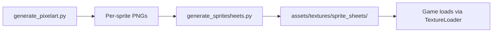
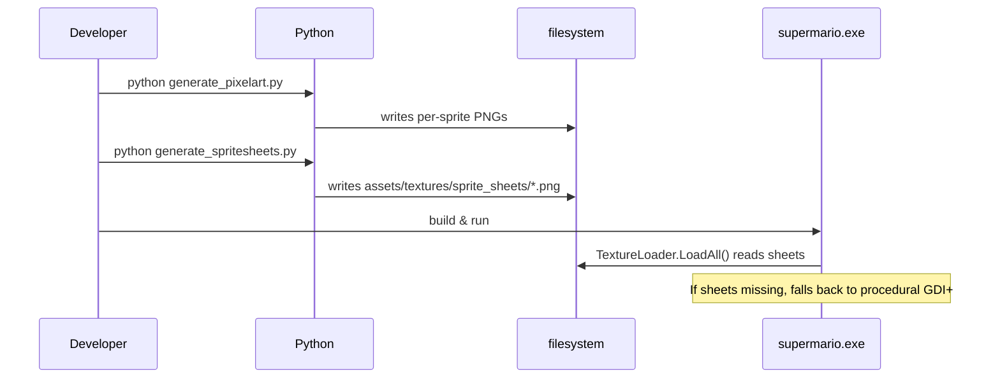
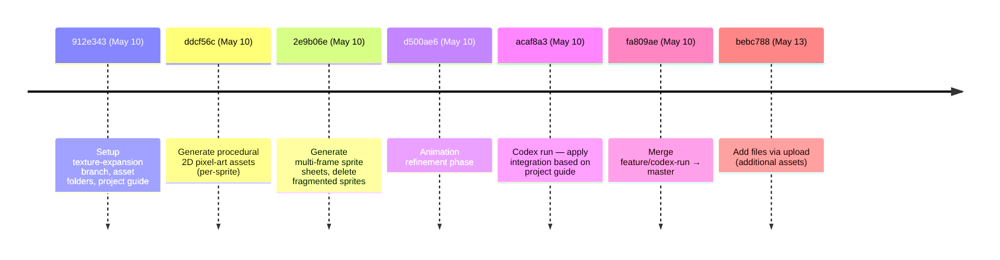

# Feature: Asset Pipeline

The repository ships **two Python scripts** that procedurally generate the game's pixel art and the sprite sheets that pack it. They live at the repository root and are run offline by developers; the game does not depend on Python at runtime.

## Scripts

| Script | Purpose |
|---|---|
| `generate_pixelart.py` | Generates the procedural per-sprite PNG files (Mario frames, enemies, items, blocks). |
| `generate_spritesheets.py` | Packs per-sprite PNGs into the five `assets/textures/sprite_sheets/*.png` atlases. |

## Pipeline



## Output (`assets/textures/sprite_sheets/`)

| File | Contains |
|---|---|
| `player_sheet.png` | Mario walk frames, jump frame, death frame, super/normal variants |
| `enemies_sheet.png` | Goomba, Koopa, FastEnemy, JumpingEnemy, PlatformPatrolEnemy, FlyingEnemy frames |
| `items_sheet.png` | Mushroom, coin (spin animation frames), fire-flower |
| `blocks_sheet.png` | Brick, Q-block (animated frames), used block, pipe pieces |
| `world_bg.png` | Sky gradient, hills, clouds (background tiles) |

## Authoring Workflow



## Why a Pipeline at All?

Two reasons recur in the commit log:
1. The procedural GDI+ enemy sprites were **already good enough** as a fallback (see [RENDERING.md](./RENDERING.md)) — the sheets are an *upgrade*, not a replacement.
2. Generating procedurally means each sprite is **deterministically reproducible** — re-running the script gives identical output, so the PNGs are in source control as the canonical authored result. (See `912e343`, `ddcf56c`, `2e9b06e`, `d500ae6`.)

## Multi-Frame Sprite Sheets

Commit `2e9b06e` switched from one-PNG-per-pose to **multi-frame sheets** with horizontal animation strips:

```
player_sheet.png:
   walk_0  walk_1  walk_2  walk_3   jump   die   super_walk_0 ...
```

The game samples a frame by computing `(globalTick / DIVISOR) % FRAME_COUNT` and slicing a rectangle out of the sheet.

## Animation Refinement (`d500ae6`)

A dedicated commit just to tune animation timings — moving walk frames forward/back by a few ticks, adjusting `DIVISOR` per animation type so the cadence matches the player's movement speed.

## Mono / .NET Framework Compatibility (`305e957`)

The C# code that consumes these textures must compile under both `.NET Framework` and `Mono/xbuild`. That meant rolling back from C# 7 tuple deconstruction in `DrawHills` / `DrawClouds` to plain `.Item1` / `.Item2` field access. The Python scripts themselves have no such constraint.

## Texture-Pack History



## Branch-Only Asset

The `texture-pack-final` branch (intentionally excluded from these docs) carries one further iteration of the asset pack; current `master` already incorporates the integrated sheets.

## See Also

- [RENDERING.md](./RENDERING.md) for what happens when these textures are missing.
- [../README.md](../README.md) for the overall feature map.
