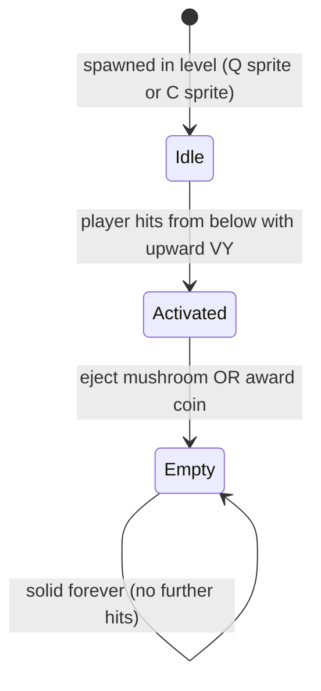
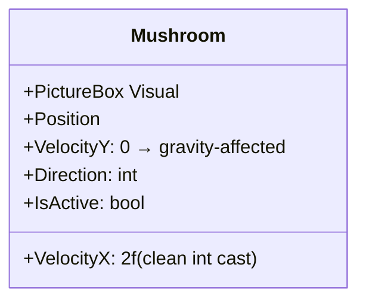
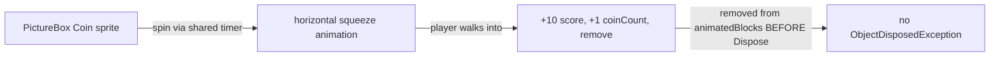
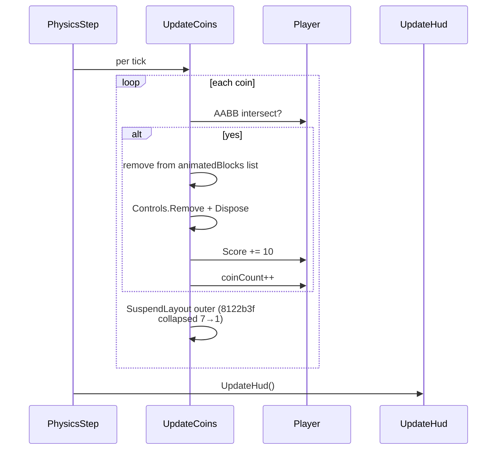

# Feature: Collectibles

Things the player picks up or activates: **mushrooms**, **coins**, and **question blocks** (both mushroom and coin variants).

## Question Blocks

```mermaid
classDiagram
  class QuestionBlock {
    +Position: Point
    +Width: 50 (block_height also 50)
    +Type: enum { Mushroom, Coin }
    +HasBeenHit: bool
    +Activated: bool
  }
  class QBlockDef {
    +X, Y: int
    +Type: PowerUpType
    +per-level array
  }
```

### Lifecycle



### Solid Physics (commit `e20b055`)

Q-blocks are fully solid: stand on top, jump on, blocked by sides. Activation only fires when the player hits from below **with upward velocity**.

```mermaid
flowchart TB
  CT[Player AABB ∩ Q-block AABB]
  CT --> RES[ResolveQBlockOverlap]
  RES --> SIDE{Smallest overlap?}
  SIDE -->|top| TOP[Stand on top — solid]
  SIDE -->|left/right| WALL[Wall — slide along side]
  SIDE -->|bottom| BCK{Player VY < 0?<br/>(moving up)}
  BCK -->|yes| ACT[ActivateQuestionBlock<br/>set HasBeenHit, Activated]
  BCK -->|no| BLK[Treat as solid ceiling, VY=0]
  ACT --> EJ{Type?}
  EJ -->|Mushroom| EJM[Eject mushroom moving right]
  EJ -->|Coin| EJC[+50 score, +1 coin]
```

### Visual Distinction

- Mushroom Q-block displays `?`.
- Coin Q-block displays `C`.

### Placement Formula

```
block_Y = platform_Y − player_height(68) − clearance(40) − block_height(50)
```

Floats 40 px above the standing player's head — walks freely beneath, jumps to hit.

### Activation Edge Cases

- Equal-height walk-by no longer triggers (commit `b67a336`) — requires upward velocity.
- Activated only once: `HasBeenHit` flag.
- Sides act as walls for both player and enemies (commit `1e82bb3`).

### Animation

A shared `questionAnimTimer` originally drove the spin animation. Commit `5a8c95c` integrated stepping into the main `GameLoop` via `_animStepCount` at ~110 ms cadence, dropping the separate timer.

## Mushrooms



### Behaviour

1. Spawns from a mushroom Q-block, ejected to the right (initially) above the block.
2. Falls under gravity, lands on platforms (full AABB collision).
3. Walks at `VelocityX = 2f` (was 1.8f; truncation made it 1 px/frame — fixed `ab0eaeb`).
4. Reverses direction on wall hit; X is clamped to world bounds after reversal (commit `2f461f1`) so it can't escape.
5. If it falls past `Y > 580` it's destroyed (memory-leak fix in `2f461f1`).
6. Player touch → `BecomeSuper` (if normal) or **absorb** (if already super, since `3cdb3fe`).

### Mushroom Collision Refinements

- `break` added after platform landing / direction-flip (commit `ab0eaeb`) — no more double-resolve jitter at platform corners.
- Pit-fall cleanup at Y > 580 (commit `2f461f1`).
- Clamp X after reversal (commit `2f461f1`).

## Coins



### Where Coins Live

- **Auto-coin rows** above every platform (`mainWin.LevelBuilder.cs`). Staircase steps (`W=40, H≥40`) are skipped so coins don't pile up on stairs (commit `0dc6869`).
- **Per-level floating coin arrays** guide the player through key jumps.

### Coin Q-blocks (subtype)

Coin Q-blocks pay out **once**: +50 score, +1 coinCount on the first underside hit. They then become permanently solid like any spent Q-block.

### Crash Fix

The coin must be removed from `animatedBlocks` **before** `Dispose()` (commit `ab0eaeb`) to avoid `ObjectDisposedException` from the next animation-timer tick.

## HUD Display

- `SCORE` — 6 digits, top line.
- `COINS` — 3 digits, second status line.
- `LIVES` — third status line (originally lives, also displays Health/3 hearts).

HUD is created **once** in `InitHud()` and updated by `UpdateHud()` (commit `6f06d18`), not recreated every frame.

## Score Carry-Forward

- Score and coinCount **carry forward on level advance**.
- They **reset on death** — only `RestartLevel` clears them, not `DoLevelSetup` (commit `ab0eaeb`).
- Both display on the win and death screens.

## Collection Code Path



## See Also

- [WORLD.md](./WORLD.md) for Q-block placement in level data.
- [COMBAT.md](./COMBAT.md) for super-state absorption of damage.
- [PLAYER.md](./PLAYER.md) for the BecomeSuper / BecomeNormal flow.
