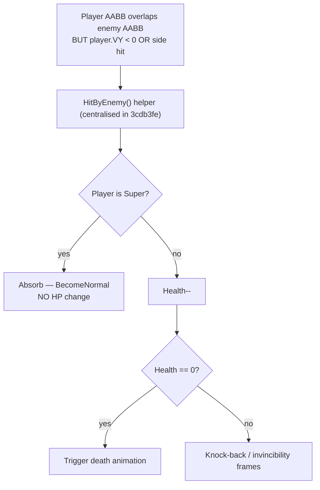
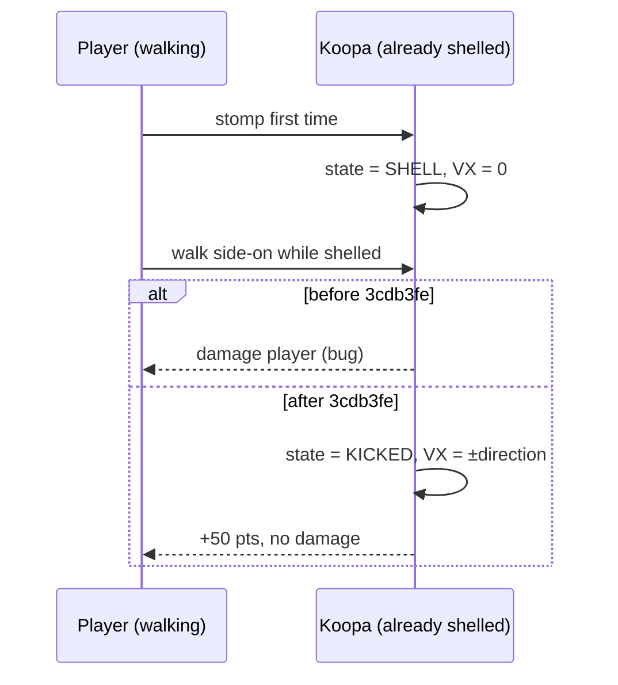

# Feature: Combat

Player-vs-enemy interactions: stomps, damage, shell kicks, fall damage.

## Stomp

```mermaid
flowchart TD
  T[Player AABB overlaps enemy AABB]
  T --> G{player.VerticalVelocity ≥ 0?<br/>(falling or steady)}
  G -->|no — moving up| MISS[ignored — not a stomp<br/>(95a0a36 fix)]
  G -->|yes| TYPE{Enemy type?}
  TYPE -->|Goomba| GS[Squish<br/>+100 pts]
  TYPE -->|FastEnemy| FS[Squish<br/>+200 pts]
  TYPE -->|JumpingEnemy| JS[Squish<br/>+150 pts]
  TYPE -->|PlatformPatrolEnemy| PS[Squish<br/>+175 pts]
  TYPE -->|Koopa walking| K1["1st stomp → shell state"]
  TYPE -->|Koopa shell| K2[Killed +150]
  TYPE -->|FlyingEnemy with wings| F1[Wings stripped<br/>+200 pts<br/>becomes ground-physics walker]
  TYPE -->|FlyingEnemy walker| F2[Squish<br/>+300 pts]
  GS --> BOUNCE
  FS --> BOUNCE
  JS --> BOUNCE
  PS --> BOUNCE
  K1 --> BOUNCE
  K2 --> BOUNCE
  F1 --> BOUNCE
  F2 --> BOUNCE
  BOUNCE[player.Bounce]
```

The `player.VerticalVelocity >= 0` guard (commit `95a0a36`) is critical — without it, *jumping up through* an enemy's body false-triggered a stomp and awarded points without actually landing.

## Damage



The centralised `HitByEnemy()` helper (commit `3cdb3fe`) is used by all six enemy-collision damage branches **and** the fall-damage path. Before that, the super power-up was being subtracted *and* HP was decreased in the same touch — a single hit could take you from Super to dead.

## Fall Damage

Separate from the pit-fall death (Y > 580). Fall damage triggers when the player has been airborne, lands, and the cumulative downward distance exceeds a threshold:

| Era | Threshold | Notes |
|---|---|---|
| Earliest | `60f` | Triggered on every normal jump — buggy |
| `5a8c95c` | `120f` | Spurious damage on normal jumps stopped |
| `3cdb3fe` | `220f` | Intended platform drops no longer cost a heart |

Fall damage also goes through `HitByEnemy()` so the super absorbs it (since `3cdb3fe`).

## Koopa Shell Kick

Added in commit `3cdb3fe`:
- A *dormant* Koopa shell hit from the side **horizontally** by a walking player now becomes a kick.
- The shell starts moving in the kick direction.
- Player gets **+50 pts**.
- Previously the same contact damaged the player who had just stomped the Koopa.



## Stomp / Damage Decision Edge Cases

Multiple commits hardened this branch:
- `95a0a36` — `VerticalVelocity >= 0` guard on stomp.
- `b67a336` — Q-block won't activate during equal-height walk-by; requires upward velocity.
- `b67a336` — Squish/shell early-out moved *before* gravity in all 6 enemy `Update` loops (no 1 px oscillation from dead-state enemies).
- `1e82bb3` — Enemies reverse direction on side-hit with Q-blocks (no enemy clipping through Q-block side).

## Stomp Reward Summary

| Action | Points |
|---|---|
| Stomp Goomba | 100 |
| Stomp FastEnemy | 200 |
| Stomp JumpingEnemy | 150 |
| Stomp PlatformPatrolEnemy | 175 |
| Stomp Koopa (shells it) | 150 |
| Stomp Koopa shell (kills it) | 150 |
| Stomp FlyingEnemy (wing strip) | 200 |
| Stomp FlyingEnemy walker | 300 |
| Kick dormant Koopa shell sideways | 50 |
| Coin (walk into) | 10 |
| Coin Q-block | 50 + 1 coin |

## Invincibility Frames

After a non-fatal `HitByEnemy()`, the player has brief invincibility (handled in `mainWin.Physics.cs`) so a single overlap doesn't cause repeated frames of HP loss.

## See Also

- [PLAYER.md](./PLAYER.md) for super-state lifecycle.
- [../ENEMIES.md](../ENEMIES.md) for each enemy's stomp behaviour.
- [PHYSICS.md](../PHYSICS.md) for fall-damage and pit-fall.
