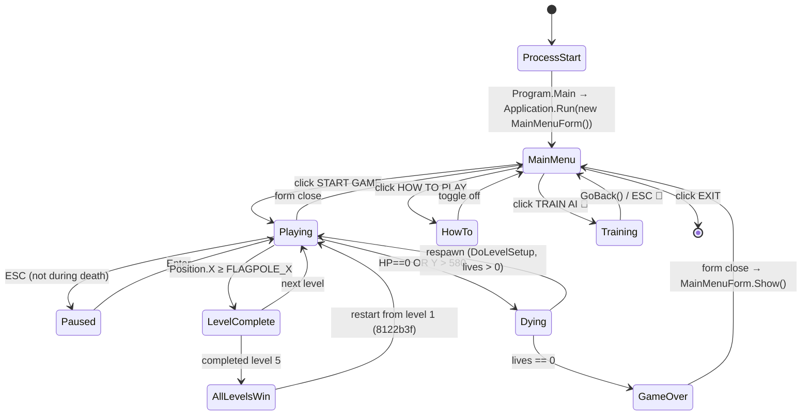
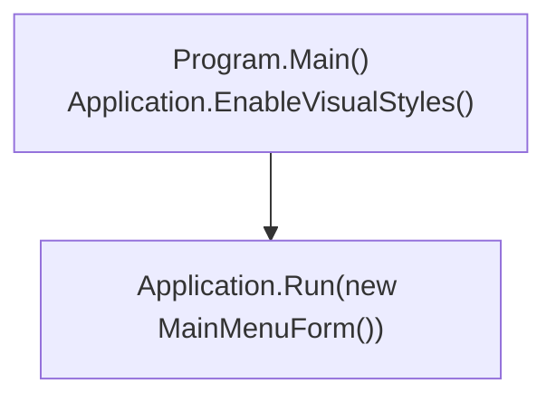
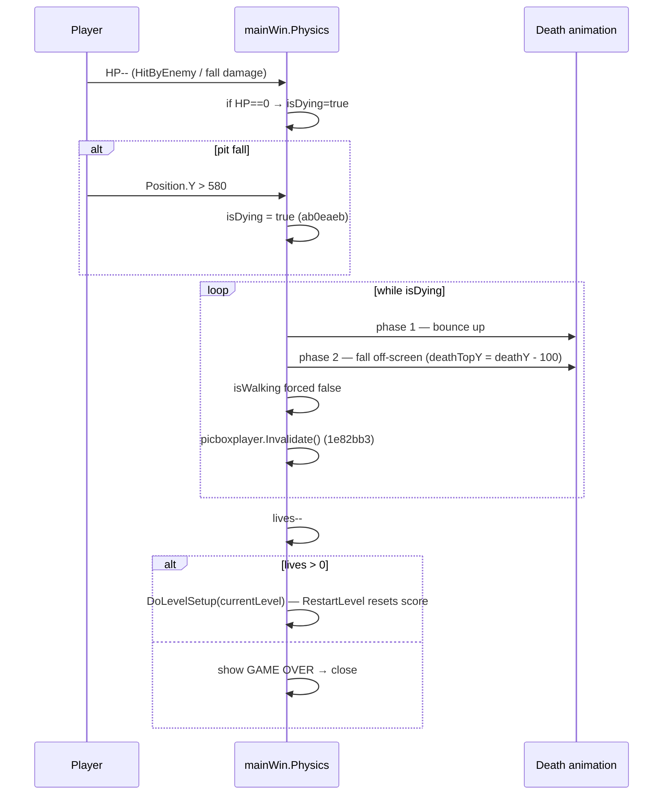
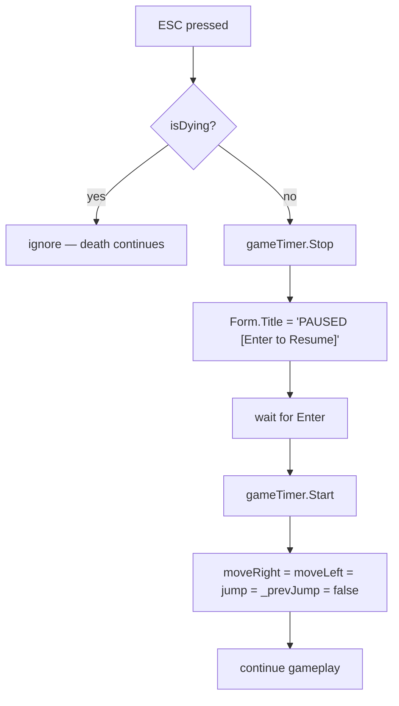
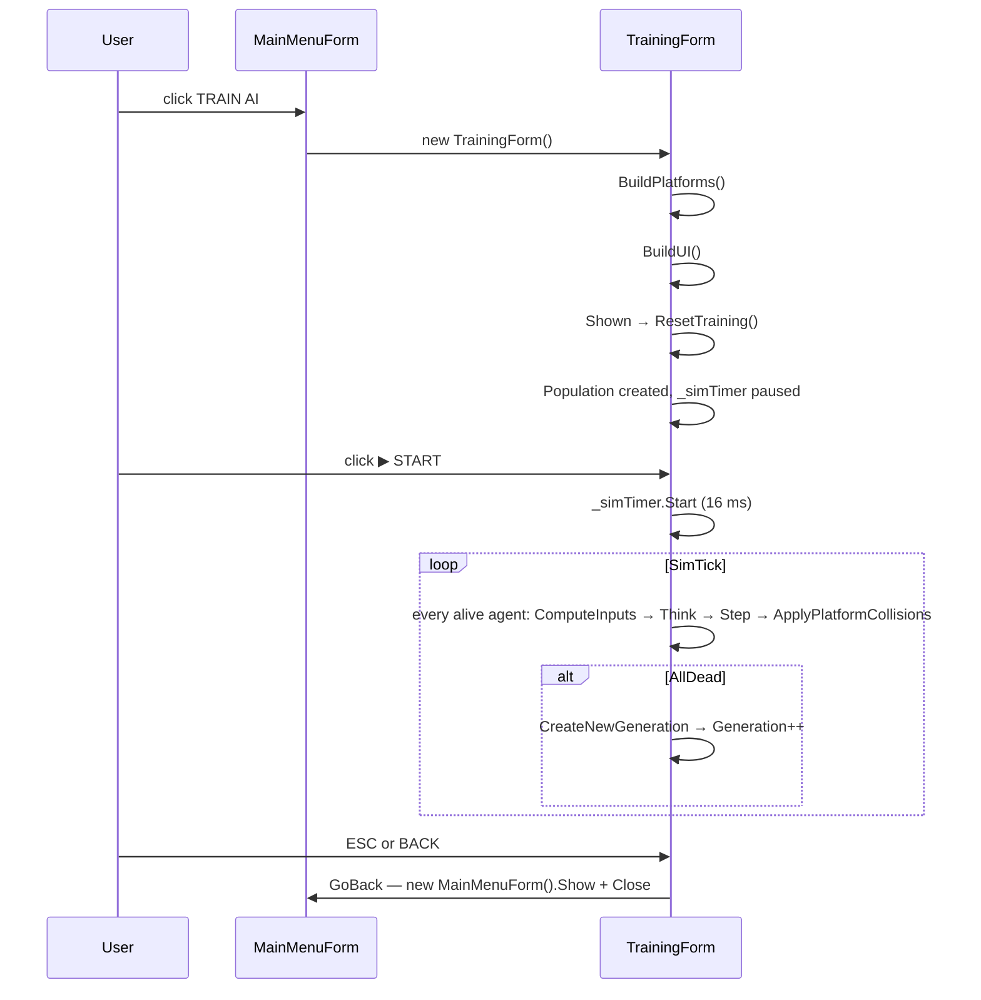

# Feature: Game Flow

The overall lifecycle of a game session — every state the application can be in and every transition between them.

## Top-Level State Machine



## Entry Point



Commit `b0bb8dc` changed `Application.Run` to launch the menu instead of `mainWin` directly.

## START GAME Click Path

```mermaid
sequenceDiagram
  participant U as User click
  participant M as MainMenuForm
  participant G as mainWin

  U->>M: click START GAME
  M->>G: var game = new mainWin();
  M->>G: game.Show();  // commit b1dbdcd ordering
  M->>M: this.Hide();
  G->>G: mainWin_Load — auto-start, no MessageBox (b0bb8dc)
  G->>G: DoLevelSetup(1)
  G->>G: gameTimer.Start()
```

`mainWin_Load`'s blocking `MessageBox` was removed in commit `b0bb8dc` so the game auto-starts the moment the form opens.

## Per-Level Setup

```mermaid
flowchart TB
  S[DoLevelSetup(levelIndex)] --> Stop[gameTimer.Stop  (1e82bb3 safety)]
  Stop --> Clear[ClearPlatforms — also clears coins, mushrooms, animatedBlocks]
  Clear --> Build[CreateLongLevel(levelIndex)]
  Build --> Spawn["player.Position = GetPlayerStartPosition()<br/>facingRight = true<br/>wasGroundedLastFrame = true"]
  Spawn --> ResetTimer[gameTimer.Start]
  ResetTimer --> Flag[_levelComplete = false]
```

Important properties:
- `_levelComplete` prevents the flagpole code from triggering twice in one level.
- Score and `coinCount` are **not** reset here — they carry forward on level advance. They're only reset in `RestartLevel` (commit `ab0eaeb`).
- `gameTimer.Stop()` before `Start` (commit `1e82bb3`) ensures level transitions are always in a clean timer state.

## Death Flow



Pause is disabled during death (commit `3cdb3fe`).

## Pause Flow



The reset of stale key state (commit `1e82bb3`) prevents a phantom jump or step on the first frame after resume.

## Level Complete Flow

```mermaid
flowchart TB
  T[Per-tick check] --> C{Position.X ≥ FLAGPOLE_X<br/>AND NOT _levelComplete?}
  C -->|no| Continue
  C -->|yes| F[_levelComplete = true]
  F --> Show[Show "LEVEL n COMPLETE" + Score + Coins]
  Show --> Wait[wait for Enter / timer]
  Wait --> Next{levelIndex == 5?}
  Next -->|no| Advance[DoLevelSetup(levelIndex+1)]
  Next -->|yes| Win
  Win[All levels complete!]
  Win --> Restart[DoLevelSetup(1) — restart from L1]
```

## TRAIN AI Flow (luigi branch 🌱)



## Application Exit

There are three exit paths:

1. **EXIT button** on the main menu → `Application.Exit()`.
2. **Close the game window** (Alt+F4 or system close) → `FormClosing` handler stops timers cleanly (commit `6f06d18`), then the menu re-shows.
3. **GAME OVER → close** → menu re-shows.

`mainWin.Designer.Dispose()` is called on every game-window close and now correctly disposes `gameTimer` and the five HUD `Font` instances (commit `3cdb3fe`).

## See Also

- [HUD_AND_MENU.md](./HUD_AND_MENU.md) — the menu UI.
- [PLAYER.md](./PLAYER.md) — death-animation specifics.
- [LUIGI_AI.md](./LUIGI_AI.md) — the TRAIN flow in detail.
