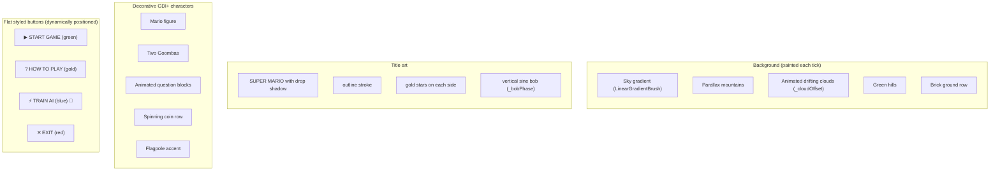
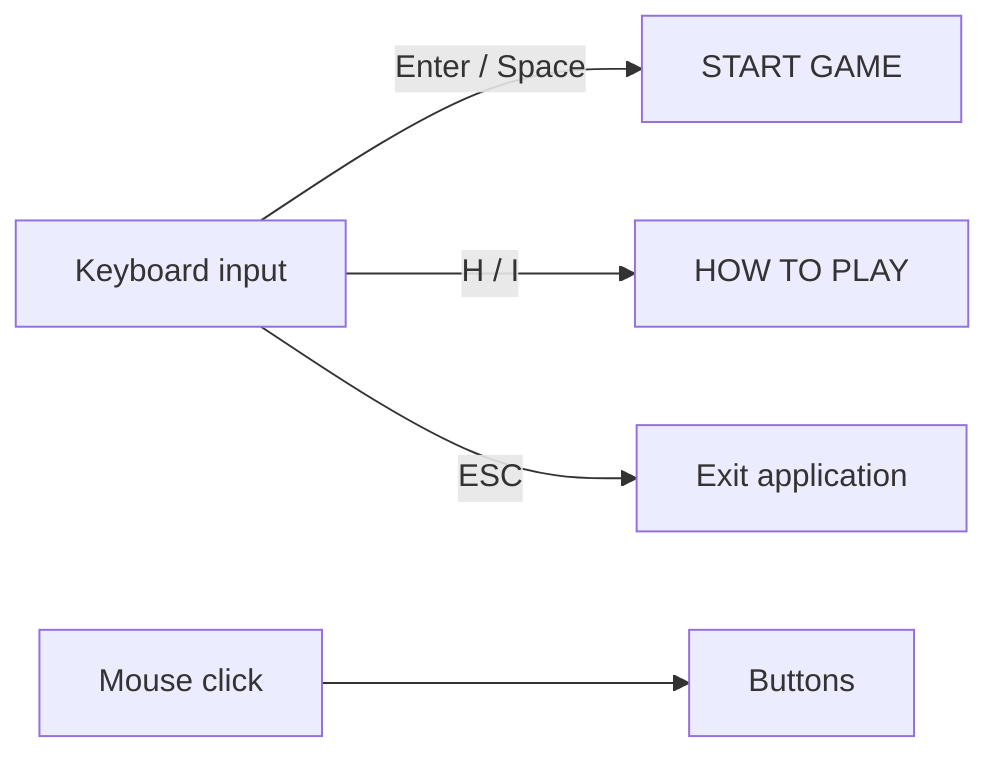
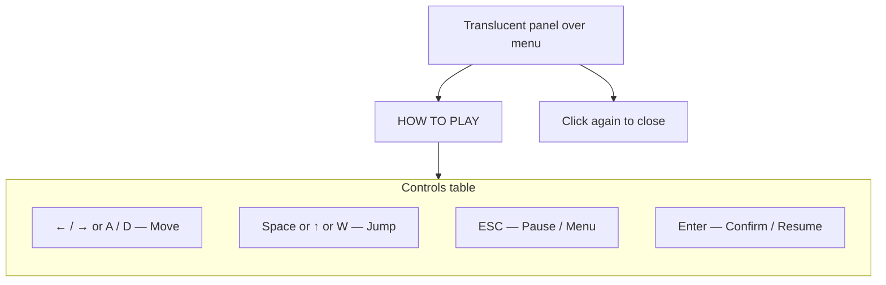
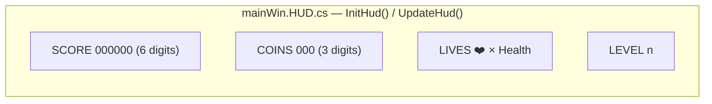
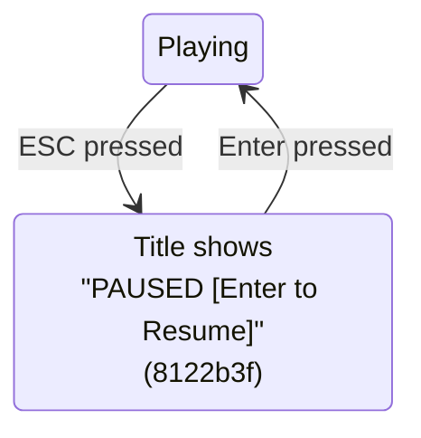

# Feature: HUD & Menu

The non-gameplay UI surfaces.

## Main Menu (`MainMenuForm`)

Added in commit `b0bb8dc`. Animated GDI+ painted menu — no controls below the buttons themselves; everything else is custom-painted.





### `LaunchGame()` ordering fix (commit `b1dbdcd`)

```csharp
game.Show();   // create + show game window FIRST
this.Hide();   // hide menu AFTER
```

Reversing this order caused a brief desktop flash between the two windows.

### Closing back to menu

When the game form closes, `MainMenuForm.Show()` is re-invoked so the player returns to the menu (replay support).

## HOW TO PLAY Overlay

Toggled by the HOW TO PLAY button (commit `b0bb8dc`).



## In-Game HUD



- Labels are created **once** in `InitHud` (commit `6f06d18`), not every frame.
- `UpdateHud` checks `_scoreLabel != null` before proceeding (commit `ab0eaeb`).
- HUD labels are at the top of the z-stack (in front of player, enemies, world).

### HUD memory hygiene

`mainWin.Designer.Dispose()` (commit `3cdb3fe`) now disposes:
- `gameTimer`
- The five HUD `Font` instances

This fixes a GDI-handle leak per game restart.

## Pause UX



ESC during the **death animation** is intentionally ignored (commit `3cdb3fe`) so the death animation can't be frozen mid-fall.

On resume, `moveRight`, `moveLeft`, `jump`, and `_prevJump` are all reset (commit `1e82bb3`) so no stale key state survives the pause and causes a phantom jump on the first frame after.

## Window Style (commit `02849c0` / `b1dbdcd`)

- `FormBorderStyle = None` — borderless, matches the main menu's chrome-less look.
- `MaximumSize` / `MinimumSize` constraints removed — they were 1000×600 and prevented the intended 982×553 client area.
- `WindowState = Maximized` removed — with `FormBorderStyle.None`, the fixed `982×553` ClientSize is the correct canvas.
- `StartPosition = CenterScreen` — the game window opens centered.

## TRAIN AI button (luigi branch 🌱)

Added in commit `4c1bc24`. 4th button on the main menu:

```mermaid
flowchart LR
  Menu[MainMenuForm]
  Menu -->|click| Train[TrainingForm.Show]
  Train -.->|GoBack() / ESC| Menu
```

- Background `Color.FromArgb(30, 120, 180)` (blue), border `Color.FromArgb(15, 70, 130)`.
- Label `"⚡  TRAIN  AI"`.
- Layout math in `MainMenuForm` updated to lay out 4 buttons instead of 3.

See [LUIGI_AI.md](./LUIGI_AI.md) and [../ml/TRAINING_FORM.md](../ml/TRAINING_FORM.md) for the form behind the button.

## See Also

- [GAME_FLOW.md](./GAME_FLOW.md) — state machine across title / play / die / pause / win.
- [WORLD.md](./WORLD.md) — what's behind the HUD.
