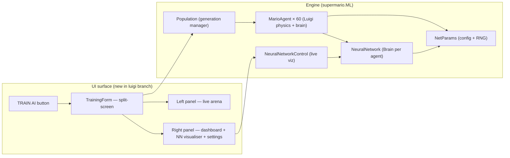
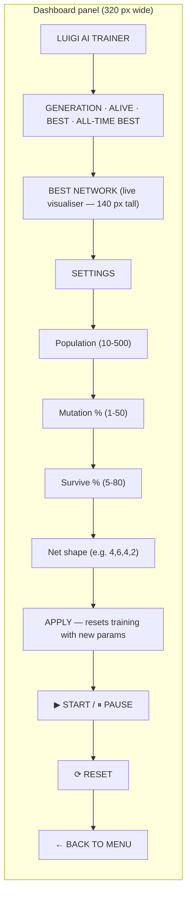
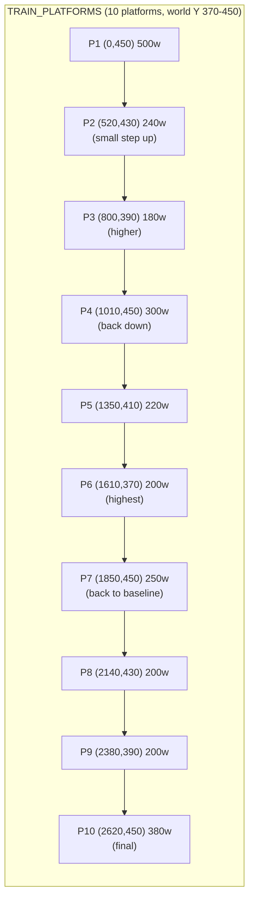
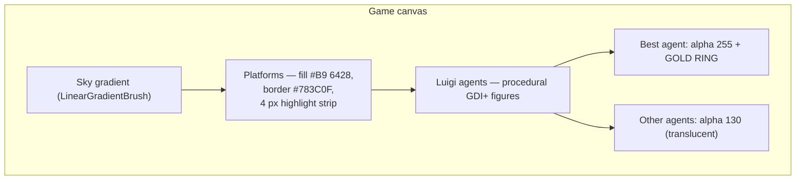

# Feature: Luigi AI 🌱

The flagship feature of the `feature/luigi-ml-training` branch. Adds a **TRAIN AI** option to the main menu that opens a live neuroevolution arena where 60 Luigi agents learn to platform.

## At a Glance



## What Happens When You Click TRAIN AI

```mermaid
sequenceDiagram
  participant User
  participant Menu as MainMenuForm
  participant Form as TrainingForm
  participant Pop as Population
  participant Loop as _simTimer

  User->>Menu: click ⚡  TRAIN AI
  Menu->>Form: new TrainingForm() — Show
  Form->>Form: BuildPlatforms (10 platforms)
  Form->>Form: BuildUI (canvas + dashboard)
  Form->>Pop: ResetTraining → new Population(SPAWN)
  Note over Pop: 60 random NeuralNetworks created
  User->>Form: click ▶ START
  Form->>Loop: _simTimer.Start (16 ms)
  loop each tick
    Loop->>Pop: step each living agent: ComputeInputs → Think → Step
    Loop->>Pop: apply collisions to each agent
    alt all dead
      Pop->>Pop: CreateNewGeneration (elitism + crossover + mutation)
    end
    Form->>Form: update dashboard, repaint canvas
  end
  User->>Form: ESC / BACK
  Form->>Menu: GoBack — re-show menu, close form
```

## Dashboard



All settings are written back to `NetParams` on **APPLY**, which then calls `ResetTraining()` — generations restart from scratch with the new parameters and random brains.

## The Arena

A flat-ish 10-platform strip designed to expose the four sensor signals (gap distance, enemy distance, platform-height diff, is-grounded):



- Spawn: `(30, 350)` — in the air, so all 60 Luigis fall onto P1 on tick 1.
- No enemies, no Q-blocks, no pipes, no coins.
- Fitness = rightmost world X each agent ever reached.

## Visuals



Every Luigi is drawn from primitives: green hat + face + mustache + light overalls + green shirt + brown shoes. The **gold ring** around the leader makes it easy to see which agent's brain is currently shown in the visualiser.

## Camera Tracking

```csharp
var leader = _pop.Agents.Where(a => a.IsAlive).OrderByDescending(a => a.Position.X).FirstOrDefault();
if (leader != null)
    _cameraX = Math.Max(0, leader.Position.X - (_canvas.Width / 3));
```

The camera follows whichever live agent is furthest right — so the action stays in frame even as the leading agents pull ahead.

## Network Visualiser

A `NeuralNetworkControl` embedded in the dashboard repaints itself each tick to show the **best agent's** current brain:

```mermaid
flowchart LR
  subgraph Viz["NeuralNetworkControl (320×140)"]
    Inputs["Input column (4 nodes)"]
    Hidden1["Hidden 1 (6 nodes)"]
    Hidden2["Hidden 2 (4 nodes)"]
    Outputs["Output (2 nodes)"]
    Inputs -. blue/red weight lines .-> Hidden1
    Hidden1 -. .-> Hidden2
    Hidden2 -. .-> Outputs
  end
```

- **Weight colour**: blue if positive, red if negative. Alpha proportional to |weight|.
- **Node colour**: brightness ∝ activation (after `tanh`), clamped to a yellow-gradient.
- Repaints every tick with fresh inputs from the best agent.

See [../ml/NEURAL_NETWORK.md](../ml/NEURAL_NETWORK.md) and [../ml/MARIO_AGENT.md](../ml/MARIO_AGENT.md) for the underlying engine details.

## Controls

| Control | Effect |
|---|---|
| ▶ **START** / ⏸ **PAUSE** | Toggle `_simTimer`. |
| ⟳ **RESET** | New `Population(SPAWN)` — random brains, generation counter back to 0. |
| **APPLY** | Validate shape string, write to `NetParams`, then `ResetTraining()`. |
| ← **BACK TO MENU** | Stops timer, opens new `MainMenuForm`, closes form. |
| **ESC** | Same as BACK. |

Settings sliders:
- **Population** — 10 to 500 (default 60).
- **Mutation %** — 1 to 50 (default 5).
- **Survive %** — 5 to 80 (default 30).
- **Net shape** — comma-separated integers, e.g. `4,6,4,2`. Validated; invalid shapes show a `MessageBox` with no state change.

## Per-Tick Flow

```mermaid
sequenceDiagram
  participant Timer as _simTimer (16ms)
  participant Form as TrainingForm
  participant Pop as Population
  participant Agent as MarioAgent
  participant NN as NeuralNetwork
  participant Visu as NeuralNetworkControl

  Timer->>Form: SimTick
  loop each alive agent
    Form->>Agent: Position.Y > 560? → IsAlive = false; continue
    Form->>Agent: ComputeInputs(world)
    Agent->>NN: Forward(inputs)
    NN-->>Agent: outputs (dir tanh, jump bool)
    Form->>Agent: Step(dir, jump)
    Form->>Form: ApplyPlatformCollisions(agent)
  end
  Form->>Form: track leader → _cameraX
  alt Pop.AllDead
    Form->>Pop: CreateNewGeneration()
    Note over Pop: top 30% survive,<br/>elitism keeps best,<br/>crossover + mutation
  end
  Form->>Form: UpdateDashboard
  Form->>Visu: SetNetwork(best.Brain, inputs)
  Form->>Form: _canvas.Invalidate
```

## See Also

- [../ml/NEUROEVOLUTION.md](../ml/NEUROEVOLUTION.md) — the algorithm step-by-step.
- [../ml/NEURAL_NETWORK.md](../ml/NEURAL_NETWORK.md) — Neuron / Layer / Network.
- [../ml/MARIO_AGENT.md](../ml/MARIO_AGENT.md) — Luigi agent physics + sensors.
- [../ml/TRAINING_FORM.md](../ml/TRAINING_FORM.md) — the form itself.
- [../ml/DATA_FLOW.md](../ml/DATA_FLOW.md) — single-tick sequence diagram (deep version).
