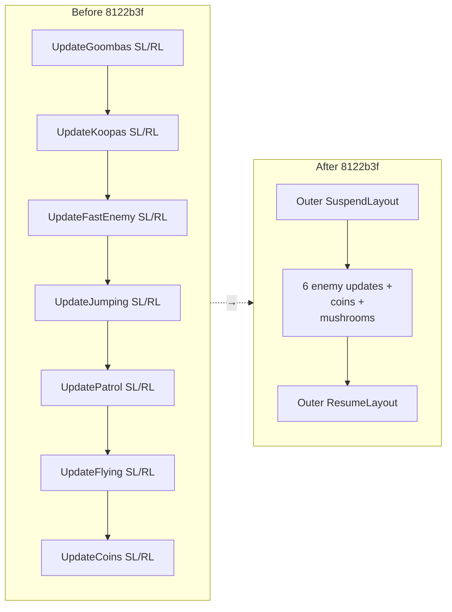
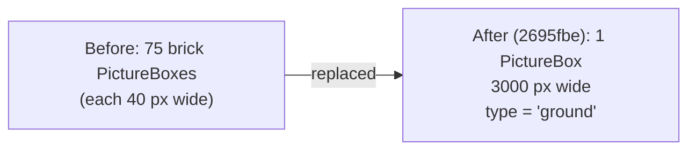
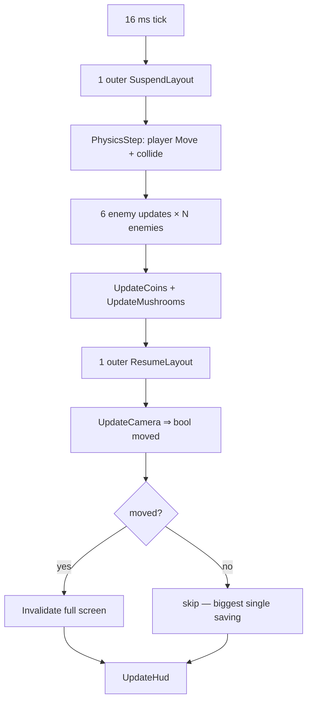

# Feature: Performance

This file catalogues every performance-relevant change in the repo. WinForms isn't natively built for high-frequency animated rendering, so a lot of the work has been about removing accidental quadratic costs.

## Master Performance Optimisations

### 1. SuspendLayout batching



7 inner pairs → **1 outer pair** per tick.

### 2. UpdateCamera returns bool

`UpdateCamera()` now returns `bool` (commit `2695fbe`). `GameLoop` only calls `Invalidate()` when the camera actually moved. Most ticks during platforming the camera is stationary — saves a full-screen repaint each one.

### 3. Single ground strip



Eliminates the dominant layout bottleneck on level load and on scroll. The `CheckPlatformCollisions` fast-path tests `Type == "ground"` and short-circuits straight into `LandOn`.

### 4. Opaque BackColor for tiles

Ground bricks and platform tiles use opaque `BackColor` (commit `5a8c95c`). Transparent controls force the parent to repaint underneath; opaque controls skip that.

### 5. ScrollObjects early-return

`ScrollObjects()` returns immediately if `scroll == 0` (commit `2695fbe`). No `SuspendLayout`/`ResumeLayout` overhead for a no-op scroll.

### 6. Removed redundant Invalidate

`Visual.Invalidate()` removed from `Update()` in all 6 enemy classes (commit `8d32679`) — the form-level `Invalidate` already covers them.

### 7. Coordinate-space cleanup

Enemy platform collision now uses world-space (`plat.Position.X`) instead of screen-space (`plat.PictureBox.Left + cameraX`) — commits `8d32679`, `5a8c95c`. Saves the per-enemy `+ cameraX` and the parent-relative `Left` lookup.

### 8. Animation timer consolidation

`questionAnimTimer` removed; animation stepping folded into `GameLoop` at ~110 ms cadence via `_animStepCount` (commit `5a8c95c`).

### 9. Timer interval

`gameTimer.Interval` raised from `8 ms` to `16 ms` (commit `5a8c95c`) — matches ~60 Hz monitor refresh; halves the tick count.

### 10. SmoothingMode

`OnPaintBackground` uses `SmoothingMode.None` (commit `5a8c95c`) — no antialiasing for pixel art.

### 11. globalTick wrap

`globalTick % 168` (commit `1e82bb3`) — LCM of all animation divisors. Prevents int overflow on multi-hour sessions while keeping animation cadence stable.

### 12. Static fallback bitmap

`DrawPlayerSprite` caches the fallback Bitmap in a static field (commit `3cdb3fe`) instead of going through `Properties.Resources` every paint.

### 13. PNG MemoryStream wrap

`TextureLoader` reads PNGs via `MemoryStream` (commit `3cdb3fe`) so the asset files aren't locked for the lifetime of the process — useful for hot-swapping art during dev.

## Resource Leaks Fixed

| Fix | Commit |
|---|---|
| `Goomba.cs` — wrap all GDI brushes/paths in `using` | `6f06d18` |
| `mainWin` — `DrawGroundBrick`, `DrawPlatformTile`, `DrawFlagpole`, `AddQuestionBlocks` GDI using-wrappers | `6f06d18` |
| `PlatformPatrolEnemy.DrawSprite` — antenna-tip `SolidBrush` in `using` | `5ec77bf` |
| `Mushroom` — pit-fall cleanup at Y > 580 (no more falling-forever objects) | `2f461f1` |
| Enemy off-world cleanup — kill at Y > 620 (was infinite CPU burn) | `c8edfbb` |
| `mainWin.Designer.Dispose` — dispose `gameTimer` + 5 HUD `Font` instances | `3cdb3fe` |
| `Coin` — remove from `animatedBlocks` **before** Dispose (no `ObjectDisposedException`) | `ab0eaeb` |

## Per-Tick Cost Map (after all optimisations)



## Luigi-AI Performance Notes 🌱

The `TrainingForm` runs **60 agents** in parallel. Each agent has its own neural network and physics state.

```mermaid
flowchart LR
  Tick["SimTick (16 ms)"]
  Tick --> Loop[for each alive agent:]
  Loop --> CI[ComputeInputs<br/>O(platforms) per agent]
  CI --> TH[NN forward pass<br/>O(weights)]
  TH --> ST[Step physics]
  ST --> CL[Collision: O(platforms)]

  CL --> Cam[Camera tracks leader<br/>(LINQ OrderByDescending)]
  Cam --> Inv[_canvas.Invalidate]
  Inv --> Paint[CanvasPaint:<br/>10 platforms + 60 Luigis]
```

With `PopulationSize = 60` and `TRAIN_PLATFORMS.Length = 10`, the per-tick cost is `60 × (O(10) + O(forward) + O(10))` ≈ a few thousand simple ops — comfortable at 60 Hz on any modern CPU.

The `Population` and `NeuralNetwork` operations use shared `NetParams.randomNum` rather than per-instance `Random` (commit `4c1bc24` notes this as one of the three bugs fixed vs the reference NN). Per-instance `Random` constructed in tight loops can produce identical seeds and broken stochasticity.

## What Was *Not* Optimised

These were intentionally left alone:

- **`OrderByDescending` on each SimTick** to find the leader and best agent. With `PopulationSize=60` this is `O(n log n)` ≈ trivial.
- **GDI+ procedural Luigi drawing**, called for every alive agent each paint. Could be cached to a bitmap but 60 agents × ~10 GDI calls/agent is still well within budget.
- **`ComputeInputs` scanning all `_platforms`** in `O(n²)` fashion per agent. With 10 platforms, irrelevant.

## See Also

- [RENDERING.md](./RENDERING.md) for paint pipeline details.
- [ARCHITECTURE.md](../ARCHITECTURE.md) for the tick sequence diagram.
- [../master.md](../master.md) for full commit-by-commit history of these optimisations.
