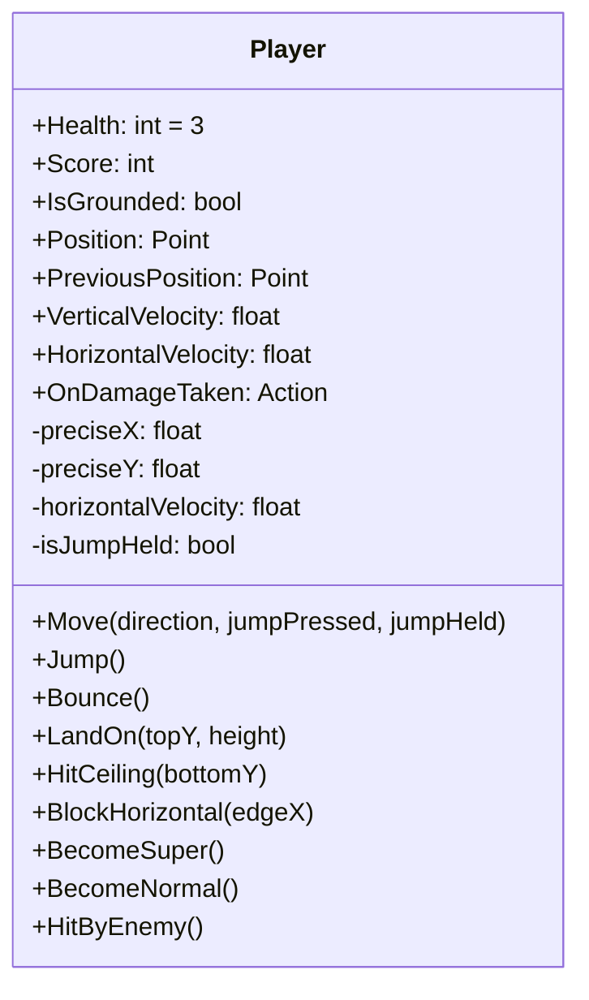
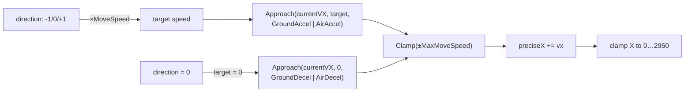
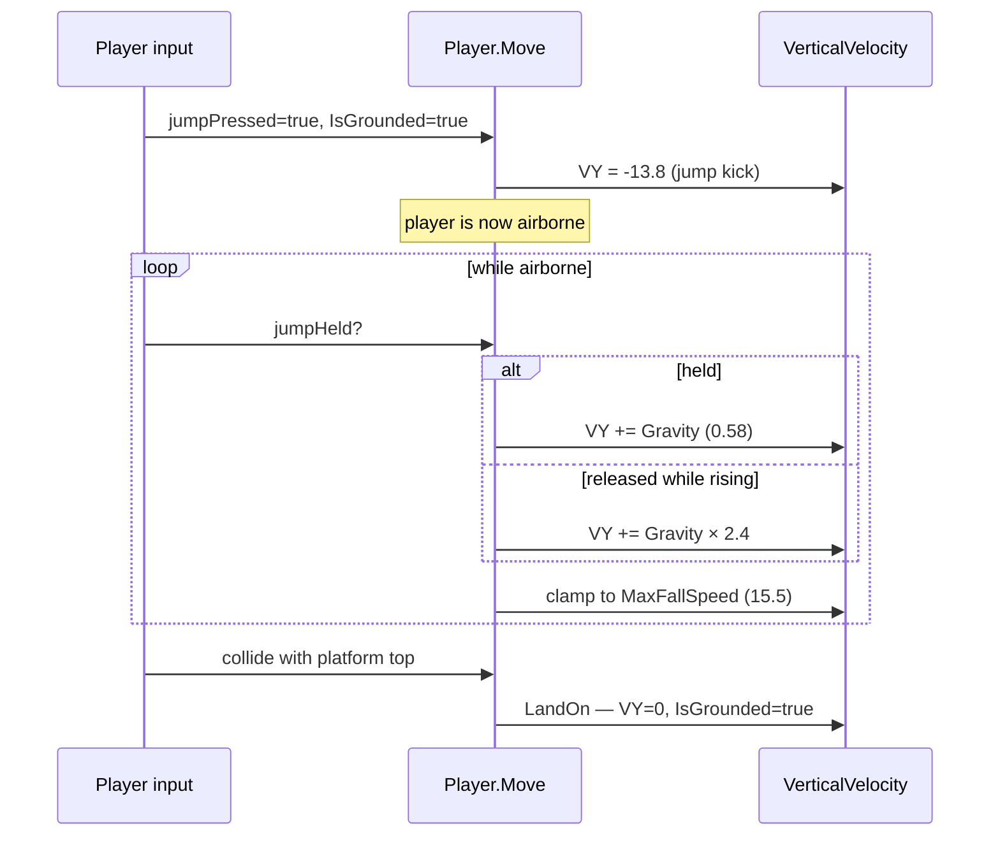
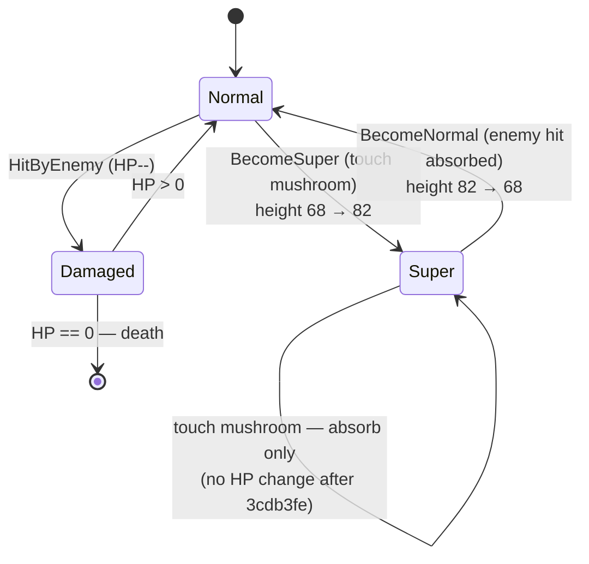

# Feature: Player

The player character (Mario) and everything about how they move, jump, spawn, die, and grow/shrink.

## Class

`supermario.Player` in `supermario/Core/Player.cs`.



## Movement

Acceleration-based, not velocity-set. The player accelerates toward a target speed defined by input direction × `MoveSpeed`, with different rates on ground vs in air.

| Constant | Value | Used for |
|---|---|---|
| `GroundMoveSpeed` | `4.4f` | Target X speed when running |
| `MaxMoveSpeed` | `5.6f` | Hard cap on X velocity |
| `GroundAcceleration` | `0.75f` | Approach target on ground |
| `AirAcceleration` | `0.42f` | Approach target in air |
| `GroundDeceleration` | `0.55f` | Approach 0 on ground (release input) |
| `AirDeceleration` | `0.16f` | Approach 0 in air (release input) |



## Jumping

`JumpPower = -13.8f` is applied as instantaneous vertical velocity on the rising edge of the jump key, but only when `IsGrounded`. A **release-cut** multiplier shortens the rise:

```csharp
if (!isJumpHeld && VerticalVelocity < 0)
    gravityToApply *= 2.4f;  // JumpReleaseGravityMultiplier
```

This produces SMB-style variable-height jumps: tap for a hop, hold for full height.



The `_prevJump` edge tracker (commit `b67a336`) ensures that holding the jump key through a landing **does not** auto-fire another jump; the player must release and re-press.

## Spawn

| Constant | Value |
|---|---|
| `PLAYER_START_X` | constant, originally hard-coded |
| `GROUND_TOP_Y` | `513` |
| Player height | `68` |

`GetPlayerStartPosition()` returns `(PLAYER_START_X, GROUND_TOP_Y - 68 = 445)`. The Y=405 spawn bug (sat 40 px above the ground) was fixed in commit `2695fbe`.

`wasGroundedLastFrame = true` is set on init and every reset (commit `9bfba3d`) so the player's landing on first frame doesn't trigger spurious fall damage.

`facingRight = true` is reset in `DoLevelSetup()` (commit `2f461f1`) so the player always faces right at the start of each level / after death.

## Super State



- `BecomeSuper`/`BecomeNormal` adjust by the **real 14 px delta** (commit `3cdb3fe`) — previously hard-coded 16 caused 2 px ground embed when shrinking / 2 px float when growing.
- Mushroom at full HP no longer auto-adds HP (commit `3cdb3fe`); the super absorb is the actual benefit.

## Death

```mermaid
flowchart TB
  T[Tick]
  T --> Check
  Check{HP == 0?<br/>OR Y > 580?}
  Check -->|no| Continue[continue tick]
  Check -->|yes| Trigger[isDying = true]
  Trigger --> Phase1[Phase 1: bounce up<br/>(arc to top of jump)]
  Phase1 --> Phase2[Phase 2: fall off-screen<br/>(starts at deathTopY = deathY - 100)]
  Phase2 --> Reset[DoLevelSetup<br/>or game-over]
```

Specific fixes:
- Phase-2 starts from top of phase-1 arc (commit `b67a336`) — no 100 px snap mid-animation.
- `UpdateCamera` no longer overwrites the death-animation position (commit `ab0eaeb`).
- `isWalking` forced `false` and `picboxplayer.Invalidate()` called each death step (commit `1e82bb3`) so the walk animation doesn't keep playing during death.
- ESC pause is **disabled** during death (commit `3cdb3fe`) so the death animation can't be frozen mid-fall.

## Pit-Fall Death

If `player.Y > 580`, the player has fallen below the ground line and is dead regardless of HP (commit `ab0eaeb`).

## Bounce on Stomp

`player.Bounce()` (commit `6f06d18`) replaces direct velocity manipulation. Called after every successful enemy stomp.

## Collision Surface

`Player` exposes four collision helpers used by the physics code in `mainWin.Physics.cs`:

| Method | What it does |
|---|---|
| `LandOn(topY, height)` | Snaps player above platform top; `VY=0`, `IsGrounded=true`, `isJumpHeld=false` |
| `HitCeiling(bottomY)` | Snaps player below platform bottom; if `VY<0` zero it |
| `BlockHorizontal(edgeX)` | Snaps player against side; `HorizontalVelocity = 0` |
| `LeaveGround()` | `IsGrounded = false` (transitional) |

## Walking Animation

After commit `b1dbdcd`, `isWalking` is assigned **after** `CheckPlatformCollisions()` so it reads post-collision `IsGrounded`. This eliminates a 1-frame walk-animation glitch on landing.

Dead `walkFrame` / `walkFrameTimer` fields were removed (`1686ab3`); animation is driven entirely by `globalTick` in `DrawPlayerSprite`.

## Related Reading

- [PHYSICS.md](../PHYSICS.md) — full physics constants and integration order.
- [COMBAT.md](./COMBAT.md) — what happens when the player touches an enemy.
- [COLLECTIBLES.md](./COLLECTIBLES.md) — mushroom touch behaviour.
- [../ml/MARIO_AGENT.md](../ml/MARIO_AGENT.md) — the AI version of the same physics.
