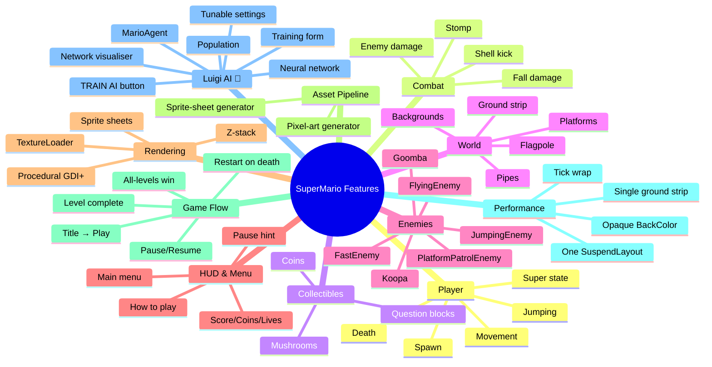
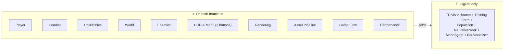

# Feature Catalogue

Every feature in the repository, documented one-by-one. Scope: `master` and `feature/luigi-ml-training` only.

A feature here means "a coherent piece of player-facing or developer-facing behaviour" — so power-ups, the camera, the procedural sprite generator, and the neuroevolution loop are all features.

## Feature Map

## Pages

| Page | What it covers |
|------|----------------|
| [PLAYER.md](./PLAYER.md) | Movement, jumping, variable jump height, spawn position, death animation, super state. |
| [COMBAT.md](./COMBAT.md) | Stomp mechanics, enemy damage, super-absorbs-hit, shell-kick, fall damage. |
| [COLLECTIBLES.md](./COLLECTIBLES.md) | Coins, mushrooms, question blocks (both mushroom and coin variants), Q-block solid-physics. |
| [WORLD.md](./WORLD.md) | Platforms, the 3000 px ground strip, pipes, flagpole, hills/clouds backgrounds. |
| [HUD_AND_MENU.md](./HUD_AND_MENU.md) | Animated main menu, HOW-TO-PLAY overlay, in-game HUD (score, coins, lives), pause hint. |
| [RENDERING.md](./RENDERING.md) | Sprite-sheet integration, TextureLoader, procedural GDI+ fallback, control z-stack. |
| [ASSET_PIPELINE.md](./ASSET_PIPELINE.md) | The two Python scripts: `generate_pixelart.py` and `generate_spritesheets.py`. |
| [GAME_FLOW.md](./GAME_FLOW.md) | Title → Play → Die → Restart → Level Complete → Win → Title state machine. |
| [PERFORMANCE.md](./PERFORMANCE.md) | All the perf optimisations: SuspendLayout batching, single-strip ground, opaque BackColor, etc. |
| [LUIGI_AI.md](./LUIGI_AI.md) 🌱 | The full Luigi AI feature surface — top-level page; deep-dives in `../ml/`. |

Six enemy types each have their own profile in [../ENEMIES.md](../ENEMIES.md).

## Master-only vs Luigi-only

The luigi branch is a strict superset — everything in master still works exactly as it did.
