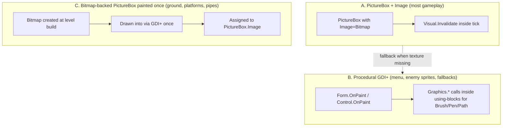
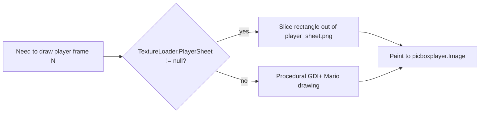
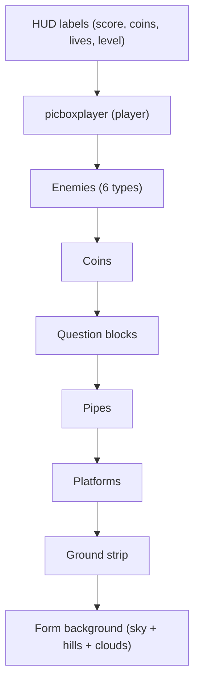

# Feature: Rendering

How pixels actually get on screen. Three coexisting rendering paths.

## Three Paths



## TextureLoader

`supermario.Core.TextureLoader` loads the five spritesheets at startup:

| Sprite sheet | Used by |
|---|---|
| `player_sheet.png` | Player walk / jump / death frames |
| `enemies_sheet.png` | 6 enemy types' walk frames |
| `items_sheet.png` | Mushroom, coin, fire-flower |
| `blocks_sheet.png` | Bricks, Q-blocks, used-blocks |
| `world_bg.png` | Sky, hills, clouds background |

### Resilience (commit `95a0a36`)

```csharp
try {
    if (!File.Exists(path)) return null;
    using (var ms = new MemoryStream(File.ReadAllBytes(path)))   // 3cdb3fe
        return new Bitmap(ms);
} catch { return null; }
```

- **`try/catch`** — a missing directory or corrupt file falls back to procedural GDI+ rendering instead of crashing.
- **`File.Exists` check** — explicit guard, more descriptive errors.
- **`MemoryStream` wrap** (commit `3cdb3fe`) — asset PNG files are **not locked for the lifetime of the process**. Without this, the files could not be replaced while the game was running.

### Texture-Aware Drawing



The fallback `Bitmap` used by `DrawPlayerSprite` is cached in a static field (commit `3cdb3fe`) instead of touching `Properties.Resources` on every paint event.

## Animation Cadence

Master at HEAD uses a single `globalTick` integer incremented each `gameTimer.Tick`. Sprites pick their frame as a function of `globalTick`:

```csharp
int frame = (globalTick / DIVISOR) % FRAME_COUNT;
```

`globalTick` wraps at **168** (LCM of all animation divisors — commit `1e82bb3`) so the modulus math is exact and the int can never overflow on long sessions.

Previously a separate `questionAnimTimer` drove coin/Q-block animation; commit `5a8c95c` folded it into the main game loop at a ~110 ms cadence via `_animStepCount`.

## Z-Stack



Before commit `be1f398`, enemies' spawn functions all called `SendToBack()` after every other control had also been `SendToBack()`ed. WinForms `SendToBack` pushes to the *absolute* back of the z-stack, so enemies ended up behind the ground bricks. Removing those `SendToBack` calls fixed enemy visibility; `BringToFront()` on the player keeps the player on top.

## Opaque Tiles

Ground bricks and platform tiles use opaque `BackColor` (commit `5a8c95c`). For a transparent control, WinForms has to repaint the *parent* under it on every move/invalidate; with opaque BackColor the parent repaint is skipped. Over ~75 ground bricks per scroll this was a massive performance win.

## Smoothing Mode

`OnPaintBackground` uses `SmoothingMode.None` (commit `5a8c95c`) — pixel-art rendering wants nearest-neighbour, not antialiased.

`MenuForm` and `NeuralNetworkControl` use `SmoothingMode.AntiAlias` for the smooth UI.

## Per-Tick Render Cost

```mermaid
sequenceDiagram
  participant Tk as gameTimer.Tick (16 ms)
  participant Loop as GameLoop
  participant Cam as UpdateCamera
  participant Inv as Form.Invalidate
  participant Paint as OnPaint chain

  Tk->>Loop: 
  Loop->>Loop: PhysicsStep + enemy updates + collectibles
  Loop->>Cam: bool moved = UpdateCamera()
  alt moved
    Loop->>Inv: Invalidate()
    Inv->>Paint: paint background gradient + visible controls
  else still
    Note over Loop: skip Invalidate — major saving
  end
  Loop->>Loop: UpdateHud()
```

`UpdateCamera` returning `bool` (commit `2695fbe`) lets the game loop **skip the full-screen `Invalidate`** when the camera is stationary — most ticks during platforming the camera is still.

## Procedural Enemy Sprites

Each of the six enemy classes has a `DrawSprite(Graphics g)` method that paints itself directly without needing a texture. This is what gives them a fallback path even before sprite sheets existed. Examples:

- **Goomba** — brown body, two big eyes, two angry brows.
- **Koopa** — green shell with dark scutes, exposed head when walking.
- **FastEnemy** — red Goomba-shaped body, motion-blur trail behind.
- **JumpingEnemy** — blue body with spring-coil feet drawn separately from the body.
- **PlatformPatrolEnemy** — orange body with an antenna and a "determined" eye.
- **FlyingEnemy** — green Parakoopa with two wing-shapes; wings vanish after first stomp.

All GDI brushes/pens/paths inside these methods are wrapped in `using` (commits `6f06d18`, `5ec77bf`) to prevent leaks.

## Background Painting

`DrawHills`, `DrawClouds` (`MainMenuForm` and shared helpers) use plain field access — no C# 7 tuple deconstruction — so the code compiles under Mono/xbuild as well as .NET Framework (commit `305e957`).

## See Also

- [ASSET_PIPELINE.md](./ASSET_PIPELINE.md) — the Python scripts that produce the PNGs.
- [PERFORMANCE.md](./PERFORMANCE.md) — every rendering perf fix in one place.
- [HUD_AND_MENU.md](./HUD_AND_MENU.md) — UI surfaces.
