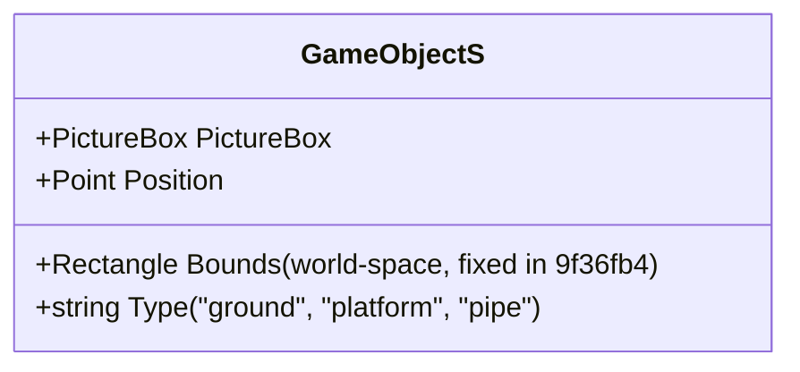
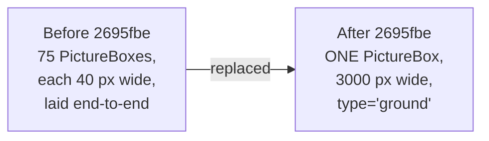
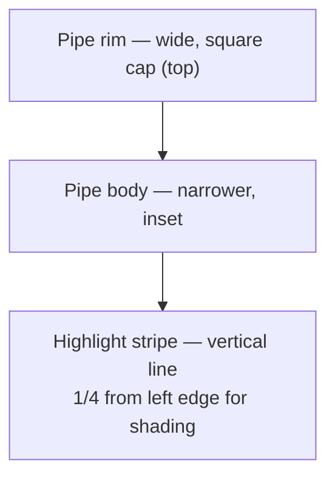
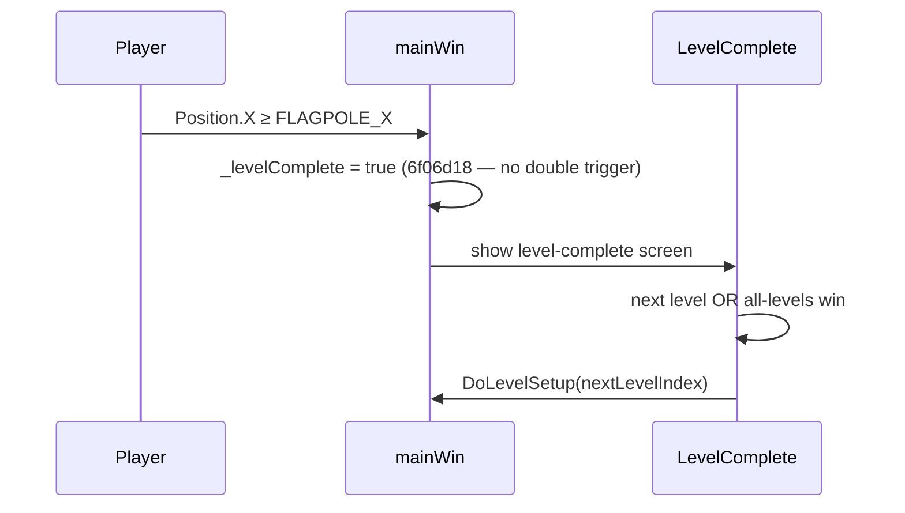
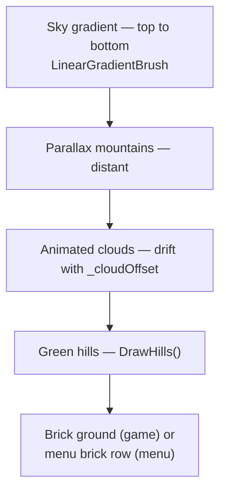
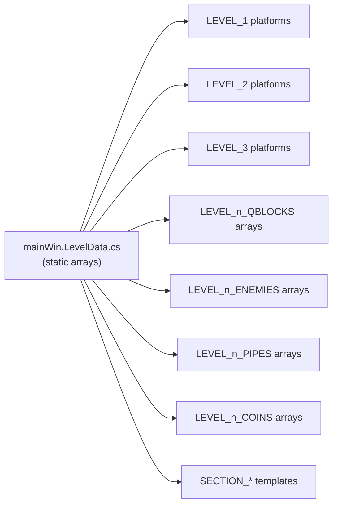

# Feature: World

The non-character pieces of the world: platforms, the ground, pipes, the flagpole, and the parallax background.

## Platforms

A `GameObjectS` wraps a `PictureBox` together with a logical world-space position and a `Type` discriminator. Collision code branches on `Type`:

- `"ground"` — single 3000 px-wide strip (commit `2695fbe`). Fast-path: always calls `LandOn` directly when overlapping (no need to compute four overlaps).
- `"platform"` — standard solid platform tile.
- `"pipe"` — solid platform with custom side-collision draw rules (commit `0dc6869`).

`Bounds` returns **world-space** rectangle (commit `9f36fb4`); previously returned `PictureBox.Bounds` which was screen-space and broke camera-aware collision checks.

## Ground

- Eliminates the dominant layout bottleneck on level load.
- Brick texture is drawn into the PictureBox bitmap once.
- Opaque `BackColor` (commit `5a8c95c`) skips transparent parent repaints.

## Pipes (Authentic Green Mario Pipes)

Added in commit `0dc6869` with `AddPipe()` and `DrawPipeTile()`.

Side-collision via `CheckPlatformCollisions()` blocks the player horizontally when approaching from the side; pipes are real obstacles.

Per-level pipe arrays: `LEVEL_1_PIPES`, `LEVEL_2_PIPES`, `LEVEL_3_PIPES`. Procedural levels (L4-L5) have **no pipes**.

## Flagpole / Level Complete

`FLAGPOLE_X`, `CAMERA_MAX`, and `LEVEL_PIXEL_WIDTH` are level-wide constants introduced in commit `6f06d18`.

## All-Levels Win

After completing all 5 levels the game now restarts from **Level 1** (commit `8122b3f`). Previously it tried to restart the current level (which was Level 5), so the player got stuck on the last level forever.

## Backgrounds

`MainMenuForm` and the game form both draw a parallax-style background:

`DrawHills` and `DrawClouds` use plain field access (no C# 7 tuple deconstruction) so the code compiles under Mono/xbuild as well as .NET Framework (commit `305e957`).

## World Bounds

| Bound | Value | Notes |
|---|---|---|
| World X min | `0` | clamp on `preciseX` |
| World X max | `2950` | clamp on `preciseX` (player and agent) |
| `LEVEL_PIXEL_WIDTH` | per-level | logical level length |
| `CAMERA_MAX` | derived | prevents scrolling past level boundary |
| Ground Y | `513` | top surface of ground strip |
| Pit-fall death Y | `580` | player Y > 580 ⇒ instant death |
| Enemy off-world Y | `600` (95a0a36), then `620` (c8edfbb) | enemy is killed and removed |

## Level Data

Section templates (25 total) for procedural levels L4-L5 live here too; see [LEVELS.md](../LEVELS.md) for the full catalogue.

## See Also

- [LEVELS.md](../LEVELS.md) — the three hand-designed levels, section templates, Q-block math.
- [RENDERING.md](./RENDERING.md) — how all of this is drawn.
- [ARCHITECTURE.md](../ARCHITECTURE.md#zstack-render-order) — the control z-stack.
