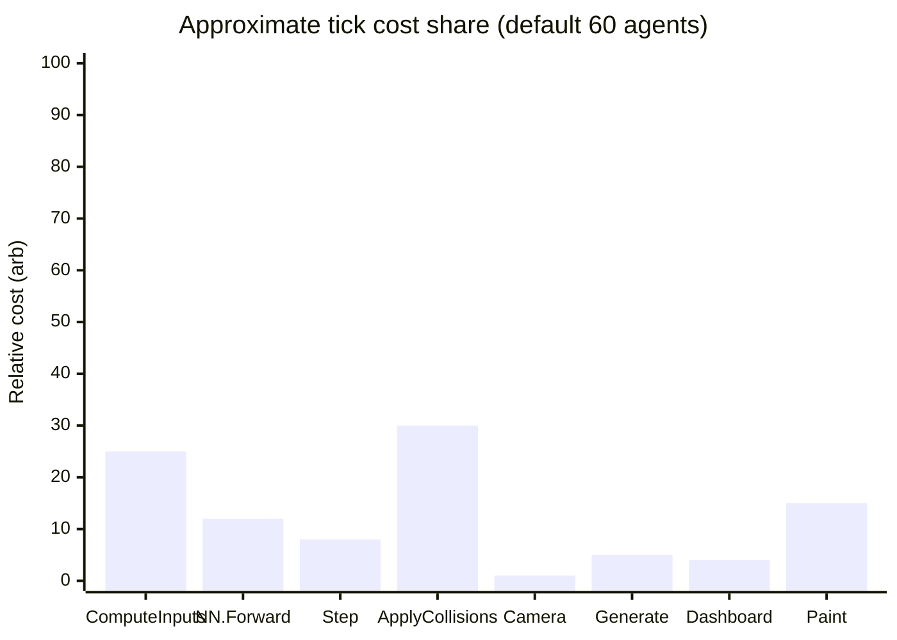
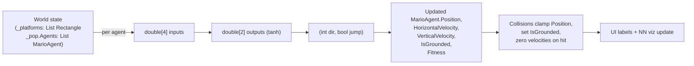
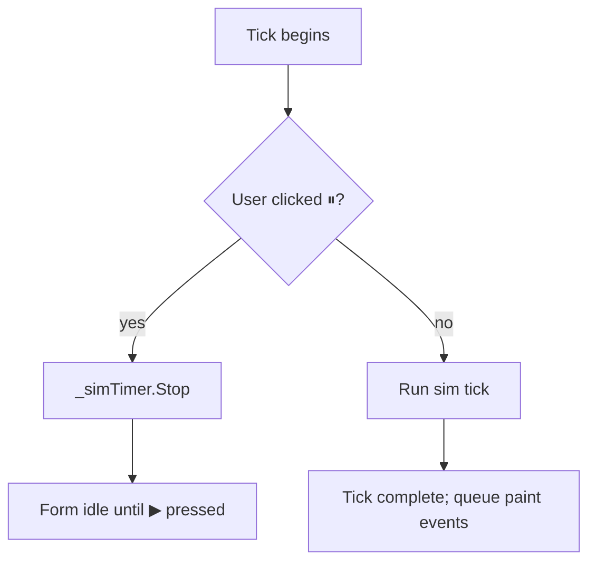
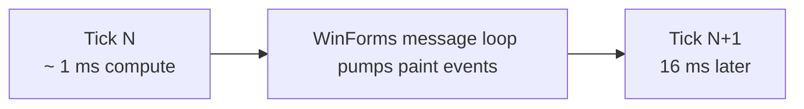

# Data Flow — One Training Tick

The exact sequence inside a single 16 ms `_simTimer` tick. Trace this from top to bottom to understand how the system pieces fit together.

## The Big Sequence Diagram

```mermaid
sequenceDiagram
  autonumber
  participant Timer as _simTimer (16 ms)
  participant TF as TrainingForm.SimTick
  participant A as MarioAgent (loop)
  participant CI as MarioAgent.ComputeInputs
  participant NN as NeuralNetwork.Forward
  participant Step as MarioAgent.Step
  participant Coll as TrainingForm.ApplyPlatformCollisions
  participant Pop as Population
  participant Dash as TrainingForm.UpdateDashboard
  participant Vis as NeuralNetworkControl
  participant Cnv as _canvas.Invalidate

  Timer->>TF: Tick
  TF->>TF: pop == null? → return

  loop for each agent in _pop.Agents
    TF->>A: agent.IsAlive?
    alt false
      Note right of TF: skip
    else true
      TF->>A: Position.Y > 560?
      alt yes
        TF->>A: IsAlive = false; continue
      else no
        TF->>CI: ComputeInputs(pos, W, H, _platforms, [], IsGrounded)
        CI-->>TF: double[4] = [gap, enemy, heightDiff, grounded]
        TF->>A: (dir, jump) = Think(inputs)
        A->>NN: Brain.Forward(inputs)
        NN-->>A: double[2] = [tanh dir, tanh jump]
        Note right of A: dir = >0.33 ? 1 : <-0.33 ? -1 : 0<br/>jump = >0.5
        TF->>Step: Step(dir, jump)
        Step->>Step: integrate X, gravity, jump
        Step->>Step: clamp X to 0..2950
        Step->>Step: update Fitness if X > Fitness
        Step->>Step: stuckTimer++ → kill if no progress @ 120
        TF->>Coll: ApplyPlatformCollisions(agent)
        Coll->>Coll: foreach plat → smallest-overlap resolve
        alt landed
          Coll->>A: LandOn(plat.Top, AGENT_H)
        else ceiling
          Coll->>A: HitCeiling(plat.Bottom)
        else side
          Coll->>A: BlockHorizontal(edge)
        end
        alt no ground found
          Coll->>A: LeaveGround()
        end
      end
    end
  end

  TF->>Pop: leader = OrderByDescending(IsAlive).First
  TF->>TF: _cameraX = max(0, leader.X - canvas.W/3)

  TF->>Pop: AllDead?
  alt yes
    Pop-->>TF: BestAgent.Fitness
    TF->>TF: _bestEver = max(_bestEver, genBest)
    TF->>Pop: CreateNewGeneration
    Pop->>Pop: GetBestAgents (top 30%, min 2)
    Pop->>Pop: next.Add(MarioAgent(survivors[0].Brain.Clone(), spawn))  // elitism
    loop until next.Count == PopulationSize
      Pop->>Pop: pick two distinct survivors
      Pop->>Pop: tilt = 0.2..0.8
      Pop->>Pop: brain = NeuralNetwork.CrossOver(A, B, tilt)
      Pop->>Pop: MutateNetwork(brain) — each Neuron.Mutate
      Pop->>Pop: next.Add(MarioAgent(brain, spawn))
    end
    Pop->>Pop: Agents = next; Generation++
  end

  TF->>Dash: UpdateDashboard
  Dash->>Vis: SetNetwork(best.Brain, inputs)
  Vis->>Vis: Invalidate (queues OnPaint)
  TF->>Cnv: _canvas.Invalidate (queues CanvasPaint)
```

## Per-Phase Time Budget (Approximate)



The two big slices are `ComputeInputs` (which iterates `_platforms` × `dx` checks per agent) and `ApplyPlatformCollisions` (10 platform × 60 agent = 600 cheap intersect tests/tick).

## Data Types Flowing Through



## When Does the Tick Stop?



Also stops on:
- ⟳ Reset (rebuilds `Population`).
- Apply settings (validates → writes `NetParams` → resets).
- ESC / BACK (`GoBack` returns to main menu).

## Live UI Updates

Two controls invalidate every tick:

| Control | What it shows | Painted by |
|---|---|---|
| `_canvas` | Sky, platforms, all alive Luigis (best with gold ring) | `CanvasPaint` |
| `_netVis` (NeuralNetworkControl) | Best agent's network nodes + weights | `NeuralNetworkControl.OnPaint` |

Both use `DoubleBuffered = true` for flicker-free repaints.

## Why It Looks Smooth



A 16 ms cadence with ~1 ms compute and ~5 ms paint per tick leaves the OS plenty of headroom for `OnPaint` to complete before the next tick. The actual 60 Hz feel comes from:
- `_simTimer.Interval = 16` (≈ 62.5 Hz).
- `DoubleBuffered = true` on both `Form` and `_canvas`.
- `SmoothingMode.AntiAlias` on the NN viz (smooth circles), `SmoothingMode.None` on the gameplay canvas (crisp pixels).

## See Also

- [NEUROEVOLUTION.md](./NEUROEVOLUTION.md) for the `CreateNewGeneration` deep dive.
- [TRAINING_FORM.md](./TRAINING_FORM.md) for the surrounding UI.
- [MARIO_AGENT.md](./MARIO_AGENT.md) for `Step`, `Think`, `ComputeInputs`.
- [NEURAL_NETWORK.md](./NEURAL_NETWORK.md) for `Brain.Forward`.
