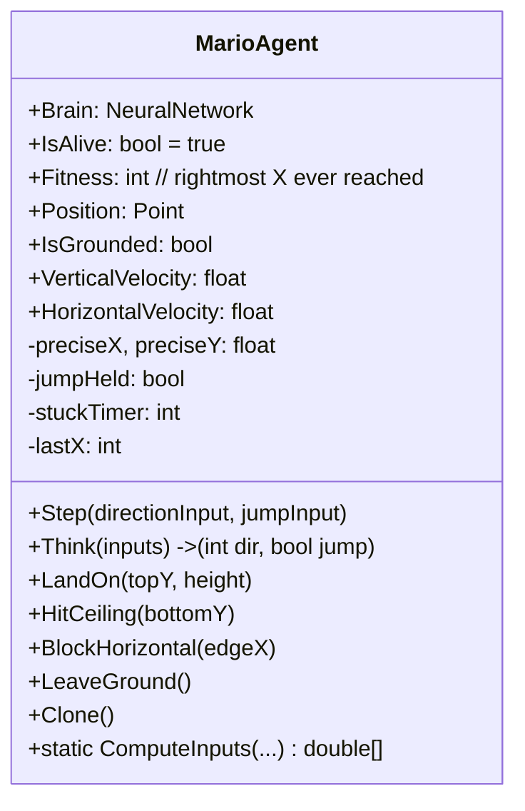
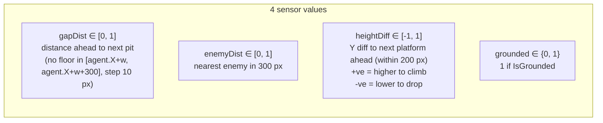
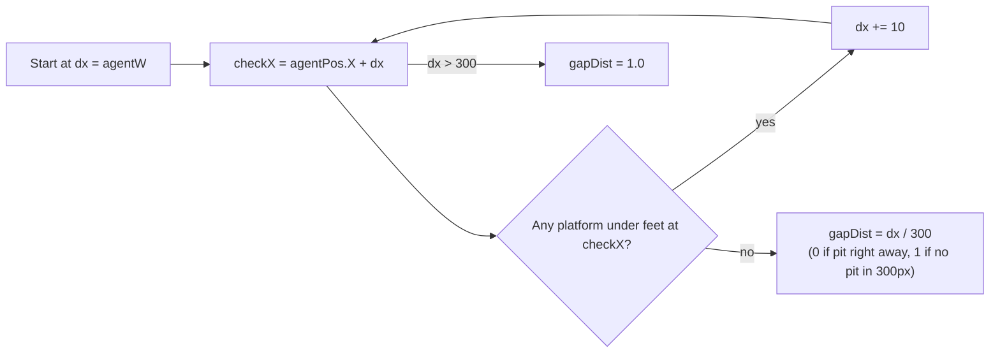
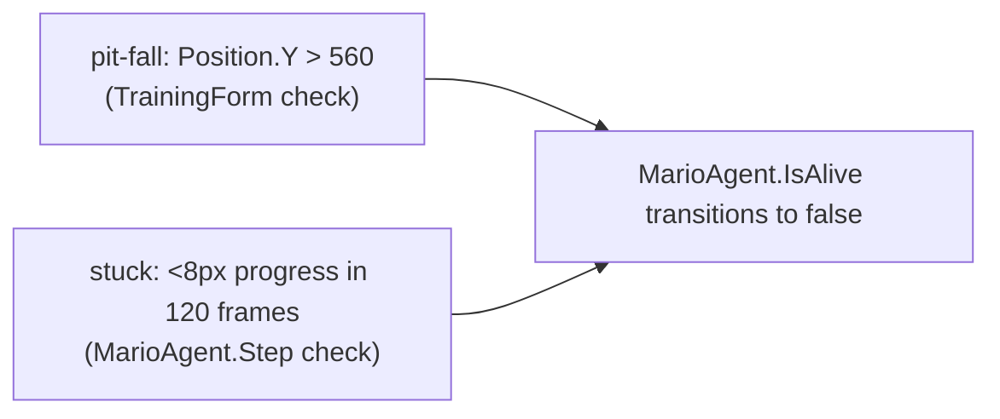

# MarioAgent (Luigi)

One Luigi AI agent. Owns its own `NeuralNetwork` and a full Mario-physics state.

## Class



## Physics Constants — Mirrors `Player`

| Constant | Value | Same as `Player`? |
|---|---|---|
| `Gravity` | `0.58f` | ✔ |
| `JumpPower` | `-13.8f` | ✔ |
| `MaxFallSpeed` | `15.5f` | ✔ |
| `MoveSpeed` | `4.4f` | ✔ |
| `MaxMoveSpeed` | `5.6f` | ✔ |
| `GroundAccel` | `0.75f` | ✔ |
| `AirAccel` | `0.42f` | ✔ |
| `GroundDecel` | `0.55f` | ✔ |
| `AirDecel` | `0.16f` | ✔ |
| Jump-release multiplier | `2.4×` | ✔ |
| World X clamp | `0…2950` | ✔ |

This is intentional: the AI experiences the same world the human player does.

## `Step(direction, jump)` — Per-Tick Physics

```mermaid
flowchart TB
  S[Step input: int dir, bool jump] --> H[targetSpeed = dir × MoveSpeed]
  H --> A[accel = IsGrounded ? GroundAccel : AirAccel<br/>decel = ... GroundDecel : AirDecel]
  A --> X1[Approach HorizontalVelocity toward target]
  X1 --> Clamp1[Clamp ±MaxMoveSpeed]
  Clamp1 --> X2[preciseX += HorizontalVelocity, clamp 0..2950]
  X2 --> JP{jump AND IsGrounded?}
  JP -->|yes| KICK[VerticalVelocity = -13.8<br/>IsGrounded = false<br/>jumpHeld = true]
  JP -->|no| NO[—]
  KICK --> H2[jumpHeld = jumpInput]
  NO --> H2
  H2 --> AIR{!IsGrounded?}
  AIR -->|yes| GR["g = 0.58<br/>if !jumpHeld AND VY<0: g *= 2.4<br/>VY = min(VY+g, 15.5)<br/>preciseY += VY"]
  AIR -->|no| GR2[VerticalVelocity = 0]
  GR --> POS[Position = round(preciseX, preciseY)]
  GR2 --> POS
  POS --> FIT[if Position.X > Fitness: Fitness = X]
  FIT --> STK[stuckTimer++<br/>every 120 frames: if no progress → IsAlive=false]
```

The float-precision `preciseX`/`preciseY` are retained between ticks so sub-pixel speeds (e.g. `4.4f`) don't lose accuracy across rounding.

## `Think(inputs)` — Neural Inference

```csharp
public (int dir, bool jump) Think(double[] inputs)
{
    double[] outputs = Brain.Forward(inputs);
    int  dir  = outputs[0] > 0.33 ? 1 : (outputs[0] < -0.33 ? -1 : 0);
    bool jump = outputs[1] > 0.5;
    return (dir, jump);
}
```

`tanh` outputs are in `[-1, 1]`. Decoding rules:
- **Direction** has a `±0.33` dead zone — small wobbles around 0 don't cause jitter.
- **Jump** triggers when `outputs[1] > 0.5` — biased toward "don't jump" by default.

## `ComputeInputs(...)` — Sensors

Four normalised values are produced from the world state by a static helper so `TrainingForm` can call it once per agent per tick:



### `gapDist`



"Has floor" is defined as: some platform `r` where `checkX ∈ [r.Left, r.Right]` and `agent.foot.Y ∈ [r.Top - 40, r.Top + 12]`.

### `enemyDist`

```csharp
foreach (var e in enemyRects) {
    int dx = e.Left - agentPos.Right;
    if (dx >= 0 && dx < 300)
        enemyDist = Math.Min(enemyDist, dx / 300.0);
}
```

Only enemies **ahead** count; behind = ignored. Default `1.0` (no enemy in range).

> In the current `TrainingForm`, `enemyRects` is always an empty list (`new List<Rectangle>()`), so this sensor is effectively always `1.0`. The plumbing is in place; enemies in the arena are a future extension.

### `heightDiff`

Looks for the **closest** platform whose `Left` is between `agent.X` and `agent.X + 200`. Returns `(agent.Y − platform.Top) / 200`, clamped to `[-1, 1]`.

- **Positive** → next platform is higher than the agent (need to climb).
- **Negative** → next platform is lower (drop).
- **Zero** → roughly level.

### `grounded`

`1.0` if `IsGrounded`, else `0.0`.

## Collision Helpers

These are called by `TrainingForm.ApplyPlatformCollisions(agent)` after each `Step`:

```mermaid
flowchart TB
  T[Compute four overlaps: top, bottom, left, right] --> M[min4]
  M --> T2{min == top?<br/>(landing) AND top < 20}
  T2 -->|yes| LO["LandOn(plat.Top, AGENT_H)"]
  M --> B{min == bottom?}
  B -->|yes| HC["HitCeiling(plat.Bottom)"]
  M --> L{min == left or right?}
  L -->|yes| BH["BlockHorizontal(plat.Left - AGENT_W OR plat.Right)"]
  M --> NO[no overlap → LeaveGround()]
```

These directly mirror `Player`'s collision helpers — same signatures, same semantics.

> Note `top < 20` threshold here vs `30` in master `Player`. The Luigi arena uses simpler geometry and the smaller threshold has been found sufficient in this branch.

## Death Conditions



Note: the agent has no Health, no Super state, no enemy damage. Agents either survive or die from one of these two reasons.

## Fitness Property

```csharp
public int Fitness { get; set; }
// inside Step:
if (Position.X > Fitness) Fitness = Position.X;
```

- Starts at 0.
- Monotonically non-decreasing within a generation.
- Used by `Population.GetBestAgents()` to sort.

## Clone

```csharp
public MarioAgent Clone() => new MarioAgent(Brain.Clone(), Position);
```

Used only conceptually; new generations create a new `MarioAgent` constructed with `(brain, _startPos)` rather than `Clone`.

## See Also

- [NEURAL_NETWORK.md](./NEURAL_NETWORK.md) for the `Brain` internals.
- [NEUROEVOLUTION.md](./NEUROEVOLUTION.md) for how `Brain` is selected/crossed/mutated.
- [TRAINING_FORM.md](./TRAINING_FORM.md) for collision and sensor wiring.
- [../features/PLAYER.md](../features/PLAYER.md) for the human-player counterpart.
