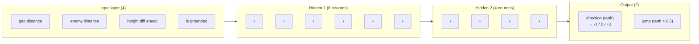
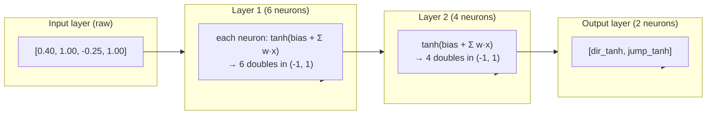

# Neural Network

The supermario.ML NN engine: `Neuron` → `Layer` → `NeuralNetwork`. Tiny by ML-library standards (~145 lines total) but complete enough to support crossover, mutation, cloning, and live visualisation.

## Topology

Default shape `{ 4, 6, 4, 2 }`:



- Activation: **`Math.Tanh`** for every neuron (input → output).
- Fully connected (each neuron sees every neuron of the previous layer).
- `layers[0]` is intentionally `null` because the input layer has no weights — values pass straight through.

## `Neuron`

```csharp
public class Neuron {
    public double[] Weights { get; private set; }   // length = numInputs, init in [-1,1]
    public double   Bias    { get; private set; }   // init in [-1,1]
    public double   Output  { get; private set; }   // last activation

    public double Forward(double[] inputs) {
        double sum = Bias;
        for (int i = 0; i < Weights.Length; i++) sum += inputs[i] * Weights[i];
        Output = NetParams.Tanh(sum);
        return Output;
    }

    public void Mutate() {
        for (int i = 0; i < Weights.Length; i++)
            if (NetParams.randomNum.NextDouble() < NetParams.MutationRate)
                Weights[i] = NetParams.randomNum.NextDouble() * 2 - 1;
        if (NetParams.randomNum.NextDouble() < NetParams.MutationRate)
            Bias = NetParams.randomNum.NextDouble() * 2 - 1;
    }

    public static Neuron CrossOver(Neuron a, Neuron b, double tilt) {
        var child = new Neuron(a.Weights.Length);
        for (int i = 0; i < a.Weights.Length; i++)
            child.Weights[i] = (NetParams.randomNum.NextDouble() < tilt) ? a.Weights[i] : b.Weights[i];
        child.Bias = (NetParams.randomNum.NextDouble() < tilt) ? a.Bias : b.Bias;
        return child;
    }

    public Neuron Clone() { /* copy weights + bias */ }
}
```

### Three Bugs Fixed (commit `4c1bc24`)

The luigi-branch commit message explicitly notes:

1. **Bias now added in `Forward`** — earlier versions of the reference code in `ml/c#/Neuron.cs` initialised a bias but never added it to the weighted sum. The output would not depend on bias at all.
2. **Shared RNG** via `NetParams.randomNum` — constructing a new `Random()` for each neuron in a tight loop produces nearly-identical seeds (the default seed is the time tick), which gives identical weights across neurons.
3. **Weights clamped to `[-1, 1]`** — the reference version had unbounded ranges; uniform `[-1, 1]` keeps activation in a sane range for `tanh`.

## `Layer`

```csharp
public class Layer {
    public int      NumInputs { get; }
    public Neuron[] Neurons   { get; }

    public Layer(int numNeurons, int numInputs) {
        NumInputs = numInputs;
        Neurons   = new Neuron[numNeurons];
        for (int i = 0; i < numNeurons; i++) Neurons[i] = new Neuron(numInputs);
    }

    public double[] Forward(double[] inputs) {
        var outputs = new double[Neurons.Length];
        for (int i = 0; i < Neurons.Length; i++) outputs[i] = Neurons[i].Forward(inputs);
        return outputs;
    }

    public static Layer CrossOver(Layer a, Layer b, double tilt) { /* per-neuron */ }
    public Layer Clone() { /* per-neuron */ }
}
```

## `NeuralNetwork`

```csharp
public class NeuralNetwork {
    public int[]  Shape { get; }    // e.g. { 4, 6, 4, 2 }
    private Layer[] layers;          // layers[0] = null (no input weights)

    public NeuralNetwork(int[] networkShape) {
        Shape  = networkShape;
        layers = new Layer[networkShape.Length];
        for (int i = 1; i < networkShape.Length; i++)
            layers[i] = new Layer(networkShape[i], networkShape[i - 1]);
    }

    public double[] Forward(double[] inputs) {
        double[] current = inputs;
        for (int i = 1; i < layers.Length; i++)
            current = layers[i].Forward(current);
        return current;
    }

    public static NeuralNetwork CrossOver(NeuralNetwork a, NeuralNetwork b, double tilt) { /* per-layer */ }
    public NeuralNetwork Clone()                                                          { /* per-layer */ }
    public Layer GetLayer(int index) => layers[index];   // used by Population.MutateNetwork and NN visualiser
}
```

### Forward Pass (Worked Example)

For inputs `[gapDist, enemyDist, heightDiff, grounded]` = `[0.40, 1.00, -0.25, 1.0]`:



In `MarioAgent.Think`, those two outputs are decoded:

```csharp
int  dir  = outputs[0] > 0.33 ? 1 : (outputs[0] < -0.33 ? -1 : 0);
bool jump = outputs[1] > 0.5;
```

So the network's left-right decision has a **dead zone**: `tanh` in `[-0.33, 0.33]` produces no motion. This prevents jittery left/right oscillation when the net is uncertain.

## Crossover

```csharp
// On NeuralNetwork
public static NeuralNetwork CrossOver(NeuralNetwork a, NeuralNetwork b, double tilt) {
    var child = new NeuralNetwork(a.Shape);
    for (int i = 1; i < a.layers.Length; i++)
        child.layers[i] = Layer.CrossOver(a.layers[i], b.layers[i], tilt);
    return child;
}

// On Neuron
for (int i = 0; i < a.Weights.Length; i++)
    child.Weights[i] = (NetParams.randomNum.NextDouble() < tilt) ? a.Weights[i] : b.Weights[i];
child.Bias = (NetParams.randomNum.NextDouble() < tilt) ? a.Bias : b.Bias;
```

`tilt` is provided by `Population.CreateNewGeneration` as `randomNum.NextDouble() * 0.6 + 0.2` (range **0.2 - 0.8**). This means:
- No single parent ever fully dominates (`tilt` never == 1 or 0).
- The child is **at least 20%** influenced by each parent.

## Mutation

```csharp
foreach (var neuron in layer.Neurons) neuron.Mutate();
```

Each weight and the bias of each neuron rolls a `NextDouble() < MutationRate` check. On hit, the value is **replaced** (not perturbed) with a fresh uniform `[-1, 1]`. This is a fairly aggressive mutation — a single hit can drastically change a connection.

## Visualisation

`NeuralNetworkControl.OnPaint` walks the network and:
1. Re-runs the forward pass to collect per-neuron activations.
2. Lays out columns left-to-right with row spacing per column.
3. Draws **lines** (weights): blue if positive, red if negative; alpha ∝ `|weight|` clamped to `[20, 200]`.
4. Draws **nodes** (neurons): brightness ∝ `(activation + 1) / 2 * 255` clamped to `[30, 255]`. Yellow/dark gradient.

See [TRAINING_FORM.md](./TRAINING_FORM.md#network-visualiser) for how the control is integrated.

## See Also

- [NEUROEVOLUTION.md](./NEUROEVOLUTION.md) for how networks are bred.
- [MARIO_AGENT.md](./MARIO_AGENT.md) for what the network is wired into.
- [DATA_FLOW.md](./DATA_FLOW.md) for forward-pass in context.
