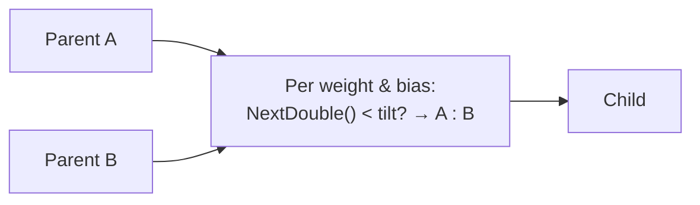
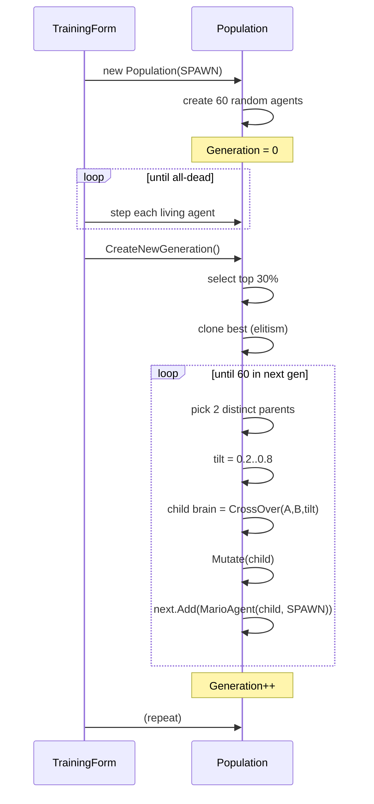

# Neuroevolution Algorithm

How the 60 Luigi brains improve over generations. Implemented in `supermario/ML/Population.cs`.

## Algorithm in One Picture

```mermaid
flowchart TB
  Gen0[Gen 0: 60 random brains, all spawn at SPAWN]
  Gen0 --> Live[Run simulation until all dead]
  Live --> Score[Each agent has Fitness = rightmost X reached]
  Score --> Sort[Sort by Fitness desc]
  Sort --> Pick[Pick top 30%<br/>(min 2 survivors)]
  Pick --> Elite[Elitism: clone best brain into next gen]
  Elite --> Cross[Repeat until 60 in next gen:<br/>pick 2 distinct survivors<br/>NeuralNetwork.CrossOver(tilt 0.2-0.8)]
  Cross --> Mut[Mutate every weight/bias<br/>at MutationRate probability]
  Mut --> Next[Generation++]
  Next --> Live
```

## Code Walkthrough — `Population.CreateNewGeneration()`

```csharp
public void CreateNewGeneration()
{
    var survivors = GetBestAgents();
    var next      = new List<MarioAgent>(NetParams.PopulationSize);

    // Elitism: keep the single best agent unchanged
    next.Add(new MarioAgent(survivors[0].Brain.Clone(), _startPos));

    while (next.Count < NetParams.PopulationSize)
    {
        // Pick two distinct parents
        int ai = NetParams.randomNum.Next(survivors.Count);
        int bi;
        do { bi = NetParams.randomNum.Next(survivors.Count); } while (bi == ai && survivors.Count > 1);

        double tilt = NetParams.randomNum.NextDouble() * 0.6 + 0.2;   // 0.2 – 0.8
        var brain   = NeuralNetwork.CrossOver(survivors[ai].Brain, survivors[bi].Brain, tilt);
        MutateNetwork(brain);
        next.Add(new MarioAgent(brain, _startPos));
    }

    Agents = next;
    Generation++;
}
```

## Selection

```csharp
public List<MarioAgent> GetBestAgents() {
    int keep = Math.Max(2, (int)(NetParams.PopulationSize * NetParams.SurviveRate));
    return Agents.OrderByDescending(a => a.Fitness).Take(keep).ToList();
}
```

- **Top-30%** by default (configurable in the UI from 5 % to 80 %).
- **Floor of 2** — even if `SurviveRate` × `PopulationSize` < 2 (e.g. with a population of 10 and a 5 % survive rate), we always keep 2 so crossover has two distinct parents.

## Fitness

`Fitness` is set inside `MarioAgent.Step`:

```csharp
if (Position.X > Fitness) Fitness = Position.X;
```

That is the **rightmost world-X the agent ever reached**, in pixels. Never resets within a generation, never decreases.

## Stuck-Detection Counterweight

Without stuck-detection, an agent that wires "do nothing" would sit at spawn forever and prevent the generation from ending. `MarioAgent.Step` ends it:

```csharp
stuckTimer++;
if (stuckTimer >= 120) {                           // every 2 s @ 60 Hz
    if (Math.Abs(Position.X - lastX) < 8) IsAlive = false;
    lastX      = Position.X;
    stuckTimer = 0;
}
```

So even a do-nothing brain dies after 2 s with `Fitness ≈ spawn.X`, freeing the generation to evolve away from inertia.

## Elitism

The cloned best agent (`survivors[0]`) is added to the next generation **unmutated**. This guarantees:
- Best-ever fitness can never *decrease* across generations.
- A spike of high mutation can't permanently destroy the best brain — it survives at least one more generation.

## Crossover with Tilt



- `tilt` is per-generation-pair-of-parents, in **`[0.2, 0.8]`**.
- A single shared `tilt` for all weights/biases of the child = "leaning toward parent A by `tilt`".
- Never `0` or `1` — guarantees both parents are represented.

## Mutation

```csharp
private static void MutateNetwork(NeuralNetwork net) {
    for (int li = 1; li < net.Shape.Length; li++)            // skip null input layer
    {
        var layer = net.GetLayer(li);
        foreach (var neuron in layer.Neurons) neuron.Mutate();
    }
}
```

Per-weight resampling at `MutationRate` probability. At default 5 %, in a typical `{4,6,4,2}` shape:

- Total weights = `6×4 + 4×6 + 2×4 = 24 + 24 + 8 = 56`
- Total biases = `6 + 4 + 2 = 12`
- Expected resamples per child ≈ `(56 + 12) × 0.05 ≈ 3.4`

Enough churn for exploration without wrecking parents.

## Population Lifecycle



## What a Run Looks Like

Empirically, with default params:

| Generation | Typical best fitness | What you see |
|---|---|---|
| 0 | ~30-150 px | Agents flop off P1 in random directions |
| 1-3 | ~300-600 px | A few stand still long enough to walk right |
| 4-10 | ~800-1500 px | Reliably reach P5/P6, start clearing gaps |
| 10-20 | ~2000-2950 px | Many reach the end of the world |
| 20+ | maxed at 2950 | Population converges; all-time best plateaus |

The `ALL-TIME BEST` counter on the dashboard preserves the high-water mark across resets.

## Tuning Effects

| Setting raised | Effect |
|---|---|
| `PopulationSize` | More exploration per gen, slower wall-clock per gen |
| `MutationRate` | More noise — risks destroying gains, helps escape local minima |
| `SurviveRate` | More parents, more dilution of best traits |
| `NetworkShape` | More hidden neurons → can represent more complex behaviour but slower to train |

## Bugs the Engine Fixes vs the Reference

The `ml/c#/` reference classes (added on master in commit `bebc788`) had three issues that `4c1bc24` corrects:

1. **Bias never used** in `Forward`.
2. **Per-instance `new Random()`** in tight loops → identical seeds.
3. **Unbounded weight initialisation**.

All three are noted in the `4c1bc24` commit body.

## See Also

- [NEURAL_NETWORK.md](./NEURAL_NETWORK.md) for the per-neuron primitives.
- [MARIO_AGENT.md](./MARIO_AGENT.md) for `Fitness`, `IsAlive`, stuck detection.
- [DATA_FLOW.md](./DATA_FLOW.md) for one-tick mechanics.
