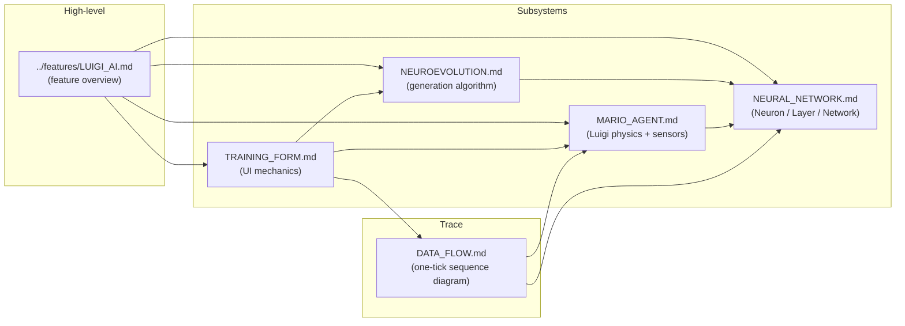

# Luigi ML Deep Dives 🌱

These pages document the **neuroevolution engine** introduced on `feature/luigi-ml-training`. They go below the "feature" level and into specific class structure, math, sensors, and per-tick mechanics.

## Page Map

## Source-Code Map

| File | Lines | Purpose |
|---|---|---|
| `supermario/ML/NetParams.cs` | 20 | Mutable config (`PopulationSize`, `MutationRate`, `SurviveRate`, `NetworkShape`), shared `Random`, `Tanh(x)` helper. |
| `supermario/ML/Neuron.cs` | 60 | Single neuron — weights, bias, `Forward`, `Mutate`, `CrossOver`, `Clone`. |
| `supermario/ML/Layer.cs` | 40 | A fully-connected layer of Neurons. |
| `supermario/ML/NeuralNetwork.cs` | 45 | Multi-layer NN: forward, crossover, clone. |
| `supermario/ML/NeuralNetworkControl.cs` | 106 | GDI+ live visualiser (UserControl). |
| `supermario/ML/MarioAgent.cs` | 195 | One Luigi agent: physics + 4-input sensors + `Think()`. |
| `supermario/ML/Population.cs` | 75 | Generational evolution: top-30% selection, elitism, crossover, mutation. |
| `supermario/UI/TrainingForm.cs` | 528 | Split-screen UI: arena + dashboard + settings. |

## Quick Defaults

| Parameter | Default | Settable in UI? |
|---|---|---|
| `PopulationSize` | 60 | yes (10-500) |
| `MutationRate` | 0.05 | yes (1-50 %) |
| `SurviveRate` | 0.30 | yes (5-80 %) |
| `NetworkShape` | `{ 4, 6, 4, 2 }` | yes (free text) |

| Constant | Value | Purpose |
|---|---|---|
| `AGENT_W` | 36 | Agent AABB width |
| `AGENT_H` | 48 | Agent AABB height |
| `DASHBOARD_W` | 320 | Right-side panel width |
| Spawn | `(30, 350)` | Air-spawn so tick 1 always has a fall |
| World X clamp | 0 - 2950 | matches master `Player` clamp |
| Death Y | 560 | falls below this ⇒ `IsAlive = false` |
| Stuck threshold | 8 px in 120 frames | otherwise `IsAlive = false` |

## Why a Separate Physics?

`MarioAgent` re-implements Mario physics in the same shape and with the **same constants** as `Player`. It does this on purpose:

1. The agent must be deterministic and **dependency-free** from the rest of the gameplay so we can spawn 60 of them without dragging in `PictureBox`, `Form`, or `mainWin` state.
2. Sensors operate on simple `Rectangle` lists — easy to populate from a single, flat `TRAIN_PLATFORMS` array in `TrainingForm`.

See [MARIO_AGENT.md](./MARIO_AGENT.md) for a side-by-side with `Player`.

## How to Read These Pages

Recommended order:
1. **[NEURAL_NETWORK.md](./NEURAL_NETWORK.md)** — primitives.
2. **[MARIO_AGENT.md](./MARIO_AGENT.md)** — what the network is wired into.
3. **[NEUROEVOLUTION.md](./NEUROEVOLUTION.md)** — how generations advance.
4. **[TRAINING_FORM.md](./TRAINING_FORM.md)** — the UI that orchestrates it all.
5. **[DATA_FLOW.md](./DATA_FLOW.md)** — exact sequence inside one tick.
