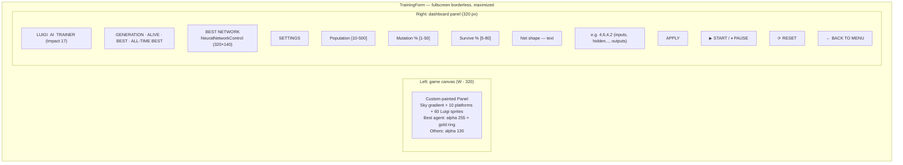
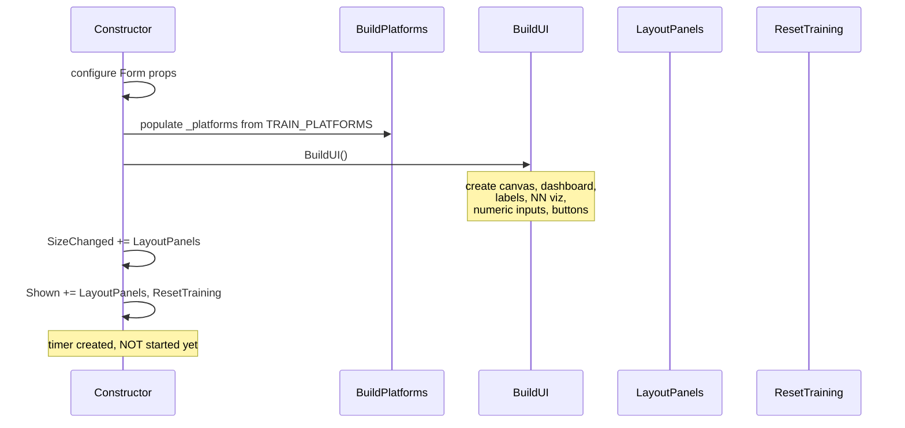
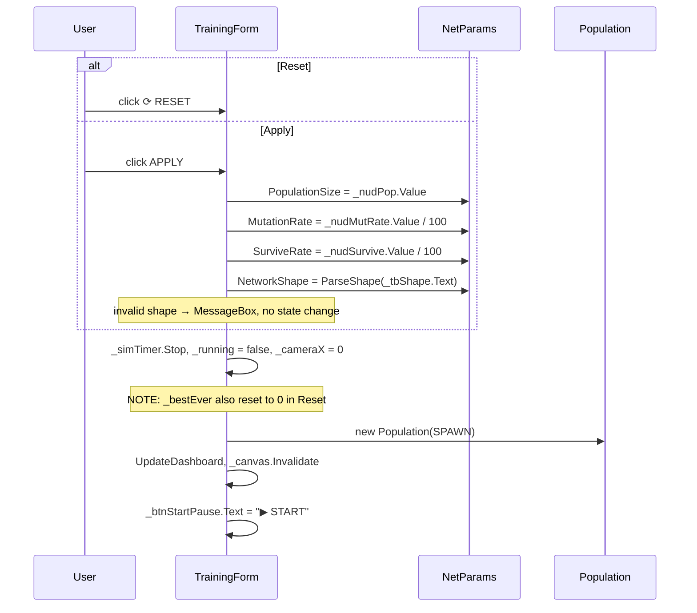
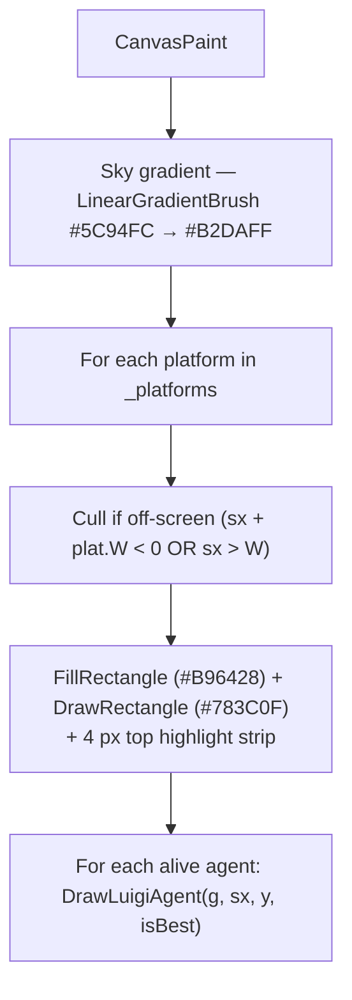

# TrainingForm

The split-screen UI that orchestrates the entire Luigi-AI feature. Implemented in `supermario/UI/TrainingForm.cs` (528 lines).

## Layout



## Form Properties

```csharp
Text            = "Luigi AI Trainer";
FormBorderStyle = FormBorderStyle.None;
WindowState     = FormWindowState.Maximized;
DoubleBuffered  = true;
BackColor       = Color.FromArgb(15, 15, 25);
KeyPreview      = true;
KeyDown        += (s,e) => { if (e.KeyCode == Keys.Escape) GoBack(); };
```

- **Fullscreen, borderless** — matches the chrome-less main-menu style.
- **Double-buffered** — no flicker for the canvas Panel.
- **`KeyPreview = true`** — captures ESC even when child controls (`NumericUpDown`, `TextBox`) have focus.

## State Fields

```csharp
private const int DASHBOARD_W = 320;
private const int AGENT_W     = 36;
private const int AGENT_H     = 48;

private Panel    _canvas;
private Timer    _simTimer;            // 16 ms tick
private int      _cameraX;
private List<Rectangle> _platforms = new List<Rectangle>();

private Population _pop;
private bool       _running;
private int        _bestEver;

private Label  _lblGen, _lblAlive, _lblBest, _lblBestEver;
private NeuralNetworkControl _netVis;

private NumericUpDown _nudPop, _nudMutRate, _nudSurvive;
private TextBox       _tbShape;
private Button        _btnApply, _btnStartPause, _btnReset, _btnBack;
```

## Build Order



`ResetTraining()` is called on first `Shown` so the form opens already showing generation 0 with a fresh population.

## Reset / Apply Settings



## Sim Tick (16 ms)

```mermaid
sequenceDiagram
  participant T as _simTimer
  participant F as SimTick
  participant A as MarioAgent
  participant P as Population

  T->>F: tick
  loop each alive agent
    F->>F: if agent.Position.Y > 560 → IsAlive=false; continue
    F->>A: ComputeInputs(world)
    F->>A: Think(inputs) → (dir, jump)
    F->>A: Step(dir, jump)
    F->>F: ApplyPlatformCollisions(agent)
  end
  F->>F: leader = OrderByDescending(IsAlive).First
  F->>F: _cameraX = max(0, leader.X - canvas.W/3)
  alt Pop.AllDead
    F->>P: int genBest = BestAgent.Fitness
    alt genBest > _bestEver
      F->>F: _bestEver = genBest
    end
    F->>P: CreateNewGeneration
  end
  F->>F: UpdateDashboard, _canvas.Invalidate
```

## Collision Subroutine — `ApplyPlatformCollisions(agent)`

```csharp
foreach (var plat in _platforms) {
    if (!ar.IntersectsWith(plat)) continue;
    int ot = ar.Bottom - plat.Top;
    int ob = plat.Bottom - ar.Top;
    int ol = ar.Right   - plat.Left;
    int orr= plat.Right - ar.Left;
    int min = Math.Min(Math.Min(ot, ob), Math.Min(ol, orr));

    if (min == ot && ot < 20)  agent.LandOn(plat.Top, AGENT_H);
    else if (min == ob)        agent.HitCeiling(plat.Bottom);
    else if (min == ol || min == orr)
        agent.BlockHorizontal(min == ol ? plat.Left - AGENT_W : plat.Right);
}
if (!foundGround) agent.LeaveGround();
```

Same `ResolveSmallestOverlap` shape as master's player physics, but with a **20 px** top-overlap threshold (master uses 30 — the smaller threshold here is fine because the arena has no fast-falling enemies to tunnel).

## Canvas Paint



The Luigi sprite is procedural GDI+ — see [LUIGI_AI.md](../features/LUIGI_AI.md#visuals).

## Dashboard Update

```csharp
private void UpdateDashboard() {
    if (_pop == null) return;
    int alive   = _pop.AliveCount;
    int total   = _pop.Agents.Count;
    int genBest = _pop.Agents.Max(a => a.Fitness);

    _lblGen.Text      = _pop.Generation.ToString();
    _lblAlive.Text    = $"{alive} / {total}";
    _lblBest.Text     = genBest.ToString();
    _lblBestEver.Text = _bestEver.ToString();

    var best = _pop.BestAgent();
    if (best != null) {
        var inputs = MarioAgent.ComputeInputs(
            best.Position, AGENT_W, AGENT_H, _platforms, new List<Rectangle>(), best.IsGrounded);
        _netVis.SetNetwork(best.Brain, inputs);
    }
}
```

`UpdateDashboard` runs every tick — labels and visualiser are always live.

## Settings Validation

```csharp
int[] shape = ParseShape(_tbShape.Text);
if (shape == null || shape.Length < 2 || shape[0] < 1 || shape[shape.Length - 1] < 1) {
    MessageBox.Show("Invalid network shape.\nUse comma-separated integers, e.g.  4,6,4,2",
        "Shape Error", MessageBoxButtons.OK, MessageBoxIcon.Warning);
    return;
}
```

- Need at least 2 layers (1 input + 1 output).
- All layer sizes must be ≥ 1.
- On error: `MessageBox`, no state change, settings retain their previous values.

## Navigation

```csharp
private void GoBack() {
    _simTimer.Stop();
    var menu = new MainMenuForm();
    menu.Show();
    Close();
}
```

- Triggered by ESC or BACK button.
- Creates a **new** `MainMenuForm` instance — clean state.

## Why Settings Reset on Apply

By design, **Apply implies Reset**. If you change `NetworkShape` mid-run, the existing brains have a different topology and can't be brought forward — so `ResetTraining` is the only safe option. The same applies less strictly to `PopulationSize` and the rates, but consistency wins over micro-optimisation here.

## See Also

- [../features/LUIGI_AI.md](../features/LUIGI_AI.md) — feature overview.
- [DATA_FLOW.md](./DATA_FLOW.md) — exact tick mechanics.
- [MARIO_AGENT.md](./MARIO_AGENT.md) — the agent the form drives.
- [NEUROEVOLUTION.md](./NEUROEVOLUTION.md) — what happens when all agents die.
